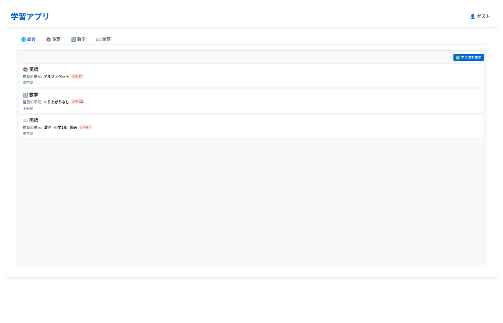

# 学習アプリ

## アプリ

- [学習アプリ](quiz/index.html) - ランダム10問の4択クイズ形式で学習できます

## コンテンツ

### 英語

#### 📢 発音

| 内容 | 解説 | 確認 | 例 |
|------|------|--------|-----|
| アルファベット（大文字・小文字と読み仮名） | [解説](english/pronunciation/alphabet/guide.md) | [確認](quiz/?subject=english&category=alphabet) | A(えー) B(びー) |
| 50音（ひらがなとローマ字） | [解説](english/pronunciation/50on/guide.md) | [確認](quiz/?subject=english&category=50on) | あ=a い=i う=u |
| 拡張ローマ字（濁音・半濁音・拗音） | [解説](english/pronunciation/romaji-advanced/guide.md) | [確認](quiz/?subject=english&category=romaji-advanced) | が=ga ぱ=pa しゃ=sha |
| フォニックス（1文字） | [解説](english/pronunciation/phonics-1letter/guide.md) | [確認](quiz/?subject=english&category=phonics-1) | `a`→/æ/ (apple) |
| フォニックス（2文字・マジックE） | [解説](english/pronunciation/phonics-2letter/guide.md) | [確認](quiz/?subject=english&category=phonics-2) | `a_e`→/eɪ/ (cake) |
| フォニックス（3文字） | [解説](english/pronunciation/phonics-3letter/guide.md) | [確認](quiz/?subject=english&category=phonics-3) | `igh`→/aɪ/ (night) |
| リンキング | [解説](english/pronunciation/linking/guide.md) | [確認](quiz/?subject=english&category=linking) | check_it→チェキッ |
| リダクション | [解説](english/pronunciation/reduction/guide.md) | [確認](quiz/?subject=english&category=reduction) | for→/fər/ |
| フラッピング | [解説](english/pronunciation/flapping/guide.md) | [確認](quiz/?subject=english&category=flapping) | water→ウォダー |
| アシミレーション | [解説](english/pronunciation/assimilation/guide.md) | [確認](quiz/?subject=english&category=assimilation) | meet you→ミーチュー |
| 発音記号（IPA） | [解説](english/pronunciation/phonetic-symbols/guide.md) | [確認](quiz/?subject=english&category=phonetic-symbols) | /æ/→ア（cat） |

#### 📝 文法

| # | 内容 | 解説 | 確認 | 例 |
|---|------|------|--------|-----|
| 11 | 一般動詞の現在形 | [解説](english/grammar/tenses-regular-present/guide.md) | [確認](quiz/?subject=english&category=tenses-regular-present) | I `play` games. |
| 12 | 一般動詞の過去形 | [解説](english/grammar/tenses-regular-past/guide.md) | [確認](quiz/?subject=english&category=tenses-regular-past) | I `played` games. |
| 13 | 一般動詞の未来形 | [解説](english/grammar/tenses-regular-future/guide.md) | [確認](quiz/?subject=english&category=tenses-regular-future) | I `will play` games. |
| 14 | be動詞の現在形 | [解説](english/grammar/tenses-be-present/guide.md) | [確認](quiz/?subject=english&category=tenses-be-present) | The game `is` fun. |
| 15 | be動詞の過去形 | [解説](english/grammar/tenses-be-past/guide.md) | [確認](quiz/?subject=english&category=tenses-be-past) | The game `was` fun. |
| 16 | be動詞の未来形 | [解説](english/grammar/tenses-be-future/guide.md) | [確認](quiz/?subject=english&category=tenses-be-future) | The game `will be` fun. |
| 17 | 不規則動詞の過去形 | [解説](english/grammar/tenses-irregular/guide.md) | [確認](quiz/?subject=english&category=tenses-irregular) | I `bought` games. |
| 18 | 冠詞 | [解説](english/grammar/articles/guide.md) | [確認](quiz/?subject=english&category=articles) | I play `a` game. |
| 19 | 形容詞 | [解説](english/grammar/adjectives/guide.md) | [確認](quiz/?subject=english&category=adjectives) | I play `fun` games. |
| 20 | 副詞 | [解説](english/grammar/adverbs/guide.md) | [確認](quiz/?subject=english&category=adverbs) | I `always` play games. |
| 21 | 前置詞 | [解説](english/grammar/prepositions/guide.md) | [確認](quiz/?subject=english&category=prepositions) | I play games `at` home. |
| 22 | 接続詞 | [解説](english/grammar/conjunctions/guide.md) | [確認](quiz/?subject=english&category=conjunctions) | I play games `and` study. |
| 23 | 進行形 | [解説](english/grammar/progressive/guide.md) | [確認](quiz/?subject=english&category=progressive) | I `am playing` games. |
| 24 | -ing形の作り方 | [解説](english/grammar/progressive-ing/guide.md) | [確認](quiz/?subject=english&category=progressive-ing) | play→`playing` |
| 25 | 完了形 | [解説](english/grammar/perfect/guide.md) | [確認](quiz/?subject=english&category=perfect) | I `have played` games. |
| 26 | 過去分詞の変化 | [解説](english/grammar/perfect-participles/guide.md) | [確認](quiz/?subject=english&category=perfect-participles) | play→`played` |
| 27 | 用法 | [解説](english/grammar/perfect-usage/guide.md) | [確認](quiz/?subject=english&category=perfect-usage) | I `have played` games `for` 3 years. |
| 28 | 使い分け | [解説](english/grammar/modals-basic/guide.md) | [確認](quiz/?subject=english&category=modals-basic) | I `can play` games. |
| 29 | 否定形 | [解説](english/grammar/modals-negative/guide.md) | [確認](quiz/?subject=english&category=modals-negative) | I `cannot play` games. |
| 30 | 過去形 | [解説](english/grammar/modals-past/guide.md) | [確認](quiz/?subject=english&category=modals-past) | I `could play` games. |
| 31 | 受動態 | [解説](english/grammar/passive/guide.md) | [確認](quiz/?subject=english&category=passive) | Games `are played` by me. |
| 32 | 助動詞の受動態 | [解説](english/grammar/passive-modals/guide.md) | [確認](quiz/?subject=english&category=passive-modals) | Games `can be played` by anyone. |
| 33 | 条件文 | [解説](english/grammar/conditionals-if/guide.md) | [確認](quiz/?subject=english&category=conditionals-if) | If I `had` time, I `would play` games. |
| 34 | I wish | [解説](english/grammar/conditionals-wish/guide.md) | [確認](quiz/?subject=english&category=conditionals-wish) | I wish I `could play` games. |
| 35 | unless | [解説](english/grammar/conditionals-unless/guide.md) | [確認](quiz/?subject=english&category=conditionals-unless) | I play games `unless` I am busy. |
| 36 | 疑問文 | [解説](english/grammar/questions/guide.md) | [確認](quiz/?subject=english&category=questions) | `Do` you play games? |
| 37 | 否定文 | [解説](english/grammar/negatives/guide.md) | [確認](quiz/?subject=english&category=negatives) | I `do not play` games. |
| 38 | 疑問詞 | [解説](english/grammar/questions-wh/guide.md) | [確認](quiz/?subject=english&category=questions-wh) | `What` games do you play? |
| 39 | 比較級 | [解説](english/grammar/comparatives-er/guide.md) | [確認](quiz/?subject=english&category=comparatives-er) | I play games `more` than you. |
| 40 | 最上級 | [解説](english/grammar/comparatives-est/guide.md) | [確認](quiz/?subject=english&category=comparatives-est) | I play games `the most`. |
| 41 | 不規則な比較変化 | [解説](english/grammar/comparatives-irregular/guide.md) | [確認](quiz/?subject=english&category=comparatives-irregular) | I play games `better` than you. |
| 42 | 主格の関係代名詞 | [解説](english/grammar/relative-subject/guide.md) | [確認](quiz/?subject=english&category=relative-subject) | The boy `who` plays games is my friend. |
| 43 | 目的格の関係代名詞 | [解説](english/grammar/relative-object/guide.md) | [確認](quiz/?subject=english&category=relative-object) | The game `which` I play is fun. |
| 44 | 所有格の関係代名詞 | [解説](english/grammar/relative-possessive/guide.md) | [確認](quiz/?subject=english&category=relative-possessive) | The boy `whose` father plays games is my friend. |
| 45 | 関係副詞 | [解説](english/grammar/relative-adverb/guide.md) | [確認](quiz/?subject=english&category=relative-adverb) | The place `where` I play games is quiet. |
| 46 | 時制の一致 | [解説](english/grammar/reported-tense/guide.md) | [確認](quiz/?subject=english&category=reported-tense) | He said he `played` games. |
| 47 | 疑問文の間接話法 | [解説](english/grammar/reported-question/guide.md) | [確認](quiz/?subject=english&category=reported-question) | He asked if I `played` games. |
| 48 | 命令文の間接話法 | [解説](english/grammar/reported-imperative/guide.md) | [確認](quiz/?subject=english&category=reported-imperative) | He told me `to play` games. |
| 49 | 指示語の変化 | [解説](english/grammar/reported-expressions/guide.md) | [確認](quiz/?subject=english&category=reported-expressions) | `this` game→`that` game |

### 数学

#### 📊 算数・基本計算

| # | 内容 | 参考学年 | 解説 | 確認 | 例 |
|---|------|----------|------|--------|-----|
| 01 | 1桁のたし算（くり上がりなし） | 小学1年 | [解説](math/arithmetic/addition-1digit-no-carry/guide.md) | [確認](quiz/?subject=math&category=addition-no-carry) | 3 + 4 = 7 |
| 02 | 1桁のたし算（くり上がりあり） | 小学1年 | [解説](math/arithmetic/addition-1digit-carry/guide.md) | [確認](quiz/?subject=math&category=addition-carry) | 7 + 8 = 15 |
| 03 | 2桁のたし算（くり上がりなし） | 小学2年 | [解説](math/arithmetic/addition-2digit-no-carry/guide.md) | [確認](quiz/?subject=math&category=addition-no-carry) | 23 + 45 = 68 |
| 04 | 2桁のたし算（くり上がりあり） | 小学2年 | [解説](math/arithmetic/addition-2digit-carry/guide.md) | [確認](quiz/?subject=math&category=addition-carry) | 47 + 38 = 85 |
| 05 | 3桁のたし算（くり上がりなし） | 小学3年 | [解説](math/arithmetic/addition-3digit-no-carry/guide.md) | [確認](quiz/?subject=math&category=addition-no-carry) | 123 + 456 = 579 |
| 06 | 3桁のたし算（くり上がりあり） | 小学3年 | [解説](math/arithmetic/addition-3digit-carry/guide.md) | [確認](quiz/?subject=math&category=addition-carry) | 347 + 285 = 632 |
| 07 | たし算（まとめ） | 小学3年 | [解説](math/arithmetic/addition-mixed/guide.md) | [確認](quiz/?subject=math&category=addition-mixed) | 6 + 9 = 15 |
| 08 | 1桁のひき算（くり下がりなし） | 小学1年 | [解説](math/arithmetic/subtraction-1digit-no-borrow/guide.md) | [確認](quiz/?subject=math&category=subtraction-no-borrow) | 8 - 3 = 5 |
| 09 | 1桁のひき算（くり下がりあり） | 小学1年 | [解説](math/arithmetic/subtraction-1digit-borrow/guide.md) | [確認](quiz/?subject=math&category=subtraction-borrow) | 13 - 7 = 6 |
| 10 | 2桁のひき算（くり下がりなし） | 小学2年 | [解説](math/arithmetic/subtraction-2digit-no-borrow/guide.md) | [確認](quiz/?subject=math&category=subtraction-no-borrow) | 58 - 23 = 35 |
| 11 | 2桁のひき算（くり下がりあり） | 小学2年 | [解説](math/arithmetic/subtraction-2digit-borrow/guide.md) | [確認](quiz/?subject=math&category=subtraction-borrow) | 52 - 37 = 15 |
| 12 | 3桁のひき算（くり下がりなし） | 小学3年 | [解説](math/arithmetic/subtraction-3digit-no-borrow/guide.md) | [確認](quiz/?subject=math&category=subtraction-no-borrow) | 689 - 234 = 455 |
| 13 | 3桁のひき算（くり下がりあり） | 小学3年 | [解説](math/arithmetic/subtraction-3digit-borrow/guide.md) | [確認](quiz/?subject=math&category=subtraction-borrow) | 503 - 278 = 225 |
| 14 | ひき算（まとめ） | 小学3年 | [解説](math/arithmetic/subtraction-mixed/guide.md) | [確認](quiz/?subject=math&category=subtraction-mixed) | 15 - 8 = 7 |
| 15 | 1桁のかけ算（九九） | 小学2年 | [解説](math/arithmetic/multiplication-1digit/guide.md) | [確認](quiz/?subject=math&category=multiplication-basic) | 6 × 7 = 42 |
| 16 | 2桁のかけ算 | 小学3年 | [解説](math/arithmetic/multiplication-2digit/guide.md) | [確認](quiz/?subject=math&category=multiplication-basic) | 23 × 4 = 92 |
| 17 | 3桁のかけ算 | 小学3年 | [解説](math/arithmetic/multiplication-3digit/guide.md) | [確認](quiz/?subject=math&category=multiplication-basic) | 123 × 4 = 492 |
| 18 | かけ算（まとめ） | 小学3年 | [解説](math/arithmetic/multiplication-mixed/guide.md) | [確認](quiz/?subject=math&category=multiplication-basic) | 6 × 7 = 42 |
| 19 | 1桁のわり算（あまりなし） | 小学3年 | [解説](math/arithmetic/division-1digit-no-remainder/guide.md) | [確認](quiz/?subject=math&category=division-no-remainder) | 12 ÷ 4 = 3 |
| 20 | 1桁のわり算（あまりあり） | 小学3年 | [解説](math/arithmetic/division-1digit-remainder/guide.md) | [確認](quiz/?subject=math&category=division-remainder) | 17 ÷ 5 = 3…2 |
| 21 | 2桁のわり算（あまりなし） | 小学3年 | [解説](math/arithmetic/division-2digit-no-remainder/guide.md) | [確認](quiz/?subject=math&category=division-no-remainder) | 84 ÷ 12 = 7 |
| 22 | 2桁のわり算（あまりあり） | 小学3年 | [解説](math/arithmetic/division-2digit-remainder/guide.md) | [確認](quiz/?subject=math&category=division-remainder) | 85 ÷ 12 = 7…1 |
| 23 | 3桁のわり算（あまりなし） | 小学4年 | [解説](math/arithmetic/division-3digit-no-remainder/guide.md) | [確認](quiz/?subject=math&category=division-no-remainder) | 840 ÷ 12 = 70 |
| 24 | 3桁のわり算（あまりあり） | 小学4年 | [解説](math/arithmetic/division-3digit-remainder/guide.md) | [確認](quiz/?subject=math&category=division-remainder) | 841 ÷ 12 = 70…1 |
| 25 | わり算（まとめ） | 小学4年 | [解説](math/arithmetic/division-mixed/guide.md) | [確認](quiz/?subject=math&category=division-mixed) | 23 ÷ 4 = 5…3 |
| 26 | たし算（同分母） | 小学4年 | [解説](math/arithmetic/fractions-same-add/guide.md) | [確認](quiz/?subject=math&category=fractions-same-add) | 1/5 + 2/5 = 3/5 |
| 27 | ひき算（同分母） | 小学4年 | [解説](math/arithmetic/fractions-same-sub/guide.md) | [確認](quiz/?subject=math&category=fractions-same-sub) | 4/7 - 2/7 = 2/7 |
| 28 | たし算（通分あり） | 小学5年 | [解説](math/arithmetic/fractions-diff-add/guide.md) | [確認](quiz/?subject=math&category=fractions-diff-add) | 1/2 + 1/3 = 5/6 |
| 29 | ひき算（通分あり） | 小学5年 | [解説](math/arithmetic/fractions-diff-sub/guide.md) | [確認](quiz/?subject=math&category=fractions-diff-sub) | 3/4 - 1/3 = 5/12 |
| 30 | かけ算 | 小学6年 | [解説](math/arithmetic/fractions-multiply/guide.md) | [確認](quiz/?subject=math&category=fractions-multiply) | 2/3 × 3/4 = 1/2 |
| 31 | わり算 | 小学6年 | [解説](math/arithmetic/fractions-divide/guide.md) | [確認](quiz/?subject=math&category=fractions-divide) | 2/3 ÷ 4/5 = 5/6 |
| 32 | たし算 | 小学5年 | [解説](math/arithmetic/decimals-addition/guide.md) | [確認](quiz/?subject=math&category=decimals-addition) | 1.2 + 3.4 = 4.6 |
| 33 | ひき算 | 小学5年 | [解説](math/arithmetic/decimals-subtraction/guide.md) | [確認](quiz/?subject=math&category=decimals-subtraction) | 5.3 - 2.1 = 3.2 |
| 34 | かけ算 | 小学5年 | [解説](math/arithmetic/decimals-multiplication/guide.md) | [確認](quiz/?subject=math&category=decimals-multiplication) | 0.3 × 0.4 = 0.12 |
| 35 | 比 | 小学6年 | [解説](math/arithmetic/ratio/guide.md) | [確認](quiz/?subject=math&category=ratio) | 4:6 = 2:3 |
| 36 | 割合 | 小学6年 | [解説](math/arithmetic/percentage/guide.md) | [確認](quiz/?subject=math&category=percentage) | 60人の30% = 18人 |

#### 📐 代数

| # | 内容 | 参考学年 | 解説 | 確認 | 例 |
|---|------|----------|------|--------|-----|
| 22 | 正負の数 | 中学1年 | [解説](math/algebra/positive-negative/guide.md) | [確認](quiz/?subject=math&category=positive-negative) | (-3) + (+5) = 2 |
| 23 | 文字式 | 中学1年 | [解説](math/algebra/algebraic-expressions/guide.md) | [確認](quiz/?subject=math&category=algebraic-expressions) | 3a + 2a = 5a |
| 24 | 一次方程式 | 中学1年 | [解説](math/algebra/linear-eq/guide.md) | [確認](quiz/?subject=math&category=linear-eq) | 2x + 3 = 7 → x = 2 |
| 25 | 連立方程式 | 中学2年 | [解説](math/algebra/simultaneous-eq/guide.md) | [確認](quiz/?subject=math&category=simultaneous-eq) | x+y=5, x-y=1 → x=3,y=2 |
| 26 | 一次関数 | 中学2年 | [解説](math/algebra/linear-func/guide.md) | [確認](quiz/?subject=math&category=linear-func) | y = 2x + 1 |
| 27 | 確率 | 中学2年 | [解説](math/algebra/probability/guide.md) | [確認](quiz/?subject=math&category=probability) | サイコロで偶数 = 3/6 = 1/2 |
| 28 | 平方根 | 中学3年 | [解説](math/algebra/square-roots/guide.md) | [確認](quiz/?subject=math&category=square-roots) | √12 = 2√3 |
| 29 | 二次方程式 | 中学3年 | [解説](math/algebra/quadratic-eq/guide.md) | [確認](quiz/?subject=math&category=quadratic-eq) | x²-5x+6=0 → x=2,3 |

#### 📈 解析・高校数学

| # | 内容 | 参考学年 | 解説 | 確認 | 例 |
|---|------|----------|------|--------|-----|
| 30 | 二次関数 | 高校1年 | [解説](math/calculus/quadratic-func/guide.md) | [確認](quiz/?subject=math&category=quadratic-func) | y = x² - 4x + 3 |
| 31 | 不等式 | 高校1年 | [解説](math/calculus/inequalities/guide.md) | [確認](quiz/?subject=math&category=inequalities) | 2x - 3 > 5 → x > 4 |
| 32 | 三角関数 | 高校2年 | [解説](math/calculus/trigonometry/guide.md) | [確認](quiz/?subject=math&category=trigonometry) | sin30° = 1/2 |
| 33 | 指数・対数 | 高校2年 | [解説](math/calculus/exponents-logarithms/guide.md) | [確認](quiz/?subject=math&category=exponents-logarithms) | log₂8 = 3 |
| 34 | 数列 | 高校2年 | [解説](math/calculus/sequences/guide.md) | [確認](quiz/?subject=math&category=sequences) | 1,3,5,7,… → aₙ=2n-1 |
| 35 | ベクトル | 高校2年 | [解説](math/calculus/vectors/guide.md) | [確認](quiz/?subject=math&category=vectors) | →a=(1,2), →b=(3,4) → →a+→b=(4,6) |
| 36 | 極限 | 高校3年 | [解説](math/calculus/limits/guide.md) | [確認](quiz/?subject=math&category=limits) | lim(n→∞) 1/n = 0 |
| 37 | 微分 | 高校3年 | [解説](math/calculus/differentiation/guide.md) | [確認](quiz/?subject=math&category=differentiation) | f(x)=x³ → f'(x)=3x² |
| 38 | 積分 | 高校3年 | [解説](math/calculus/integration/guide.md) | [確認](quiz/?subject=math&category=integration) | ∫2xdx = x² + C |

### 国語

#### 📖 漢字

| # | 内容 | 参考学年 | 解説 | 確認 | 例 |
|---|------|----------|------|--------|-----|
| 01 | 漢字（小学1年） | 小学1年 | [解説](japanese/kanji/kanji-grade1/guide.md) | [確認](quiz/?subject=japanese&category=kanji-grade1) | 山・川・火・水 |
| 02 | 漢字（小学2年） | 小学2年 | [解説](japanese/kanji/kanji-grade2/guide.md) | [確認](quiz/?subject=japanese&category=kanji-grade2) | 海・魚・鳥・読 |
| 03 | 漢字（小学3年） | 小学3年 | [解説](japanese/kanji/kanji-grade3/guide.md) | [確認](quiz/?subject=japanese&category=kanji-grade3) | 明・暗・始・終 |
| 04 | 漢字（小学4年） | 小学4年 | [解説](japanese/kanji/kanji-grade4/guide.md) | [確認](quiz/?subject=japanese&category=kanji-grade4) | 愛・熱・静・感 |
| 05 | 漢字（小学5年） | 小学5年 | [解説](japanese/kanji/kanji-grade5/guide.md) | [確認](quiz/?subject=japanese&category=kanji-grade5) | 護・衛・複・雑 |
| 06 | 漢字（小学6年） | 小学6年 | [解説](japanese/kanji/kanji-grade6/guide.md) | [確認](quiz/?subject=japanese&category=kanji-grade6) | 宙・射・危・険 |
| 07 | 漢字（中学生） | 中学生 | [解説](japanese/kanji/kanji-secondary/guide.md) | [確認](quiz/?subject=japanese&category=kanji-secondary) | 背・滋・賢・縦 |
| 08 | 漢字（高校生） | 高校生 | [解説](japanese/kanji/kanji-high/guide.md) | [確認](quiz/?subject=japanese&category=kanji-high) | 羅・曖・昧・冶 |

#### 📚 ことわざ・四字熟語

| # | 内容 | 参考学年 | 解説 | 確認 | 例 |
|---|------|----------|------|--------|-----|
| 09 | ことわざ | 中学生 | [解説](japanese/kanji/kotowaza/guide.md) | [確認](quiz/?subject=japanese&category=kotowaza) | 七転び八起き |
| 10 | 四字熟語 | 中学生 | [解説](japanese/kanji/yojijukugo/guide.md) | [確認](quiz/?subject=japanese&category=yojijukugo) | 一石二鳥 |

## 科目別リンク

- [英語の確認](quiz/?subject=english) - 英語の4択クイズ
- [数学の確認](quiz/?subject=math) - 数学の4択クイズ
- [国語の確認](quiz/?subject=japanese) - 国語の4択クイズ
