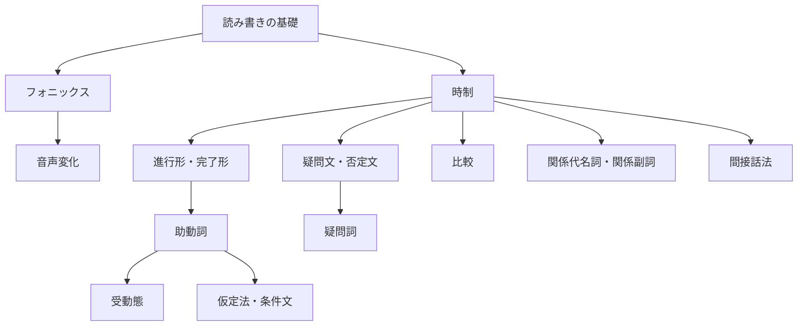

# 英語学習ガイド

## 学習の流れ

英語学習は「読み書きの基礎」→「音の理解」→「文法」の順に進みます。文法は基本的な文の形から、応用的な表現へと段階的に学習します。

### 1. 読み書きの基礎

- [アルファベット](01-alphabet/drill.md) — 大文字・小文字と読み仮名
- [50音](02-50on/drill.md) — ひらがなとローマ字の対応

### 2. フォニックス（音と文字の関係）

- [フォニックス（1文字）](03-phonics-1letter/drill.md) — 1文字の基本的な音
- [フォニックス（2文字・マジックE）](04-phonics-2letter/drill.md) — 2文字の組み合わせの音
- [フォニックス（3文字）](05-phonics-3letter/drill.md) — 3文字の組み合わせの音

### 3. 音声変化（リスニング・スピーキング）

- [リンキング](07-linking/drill.md) — 音がつながる現象
- [リダクション](08-reduction/drill.md) — 音が弱くなる・消える現象
- [フラッピング](09-flapping/drill.md) — t/d がラ行の音に変わる現象
- [アシミレーション](10-assimilation/drill.md) — 隣り合う音が影響し合う現象

### 4. 時制（動詞の変化）

- [一般動詞の現在形](11-tenses-regular-present/drill.md) — I `play` games.
- [一般動詞の過去形](12-tenses-regular-past/drill.md) — I `played` games.
- [一般動詞の未来形](13-tenses-regular-future/drill.md) — I `will play` games.
- [be動詞の過去形](14-tenses-be-past/drill.md) — I `was` happy.
- [be動詞の未来形](15-tenses-be-future/drill.md) — I `will be` happy.
- [不規則動詞の過去形](16-tenses-irregular/drill.md) — I `went` to school.

### 5. 進行形・完了形

- [進行形](17-progressive/drill.md) — I `am playing` games.
- [-ing形の作り方](18-progressive-ing/drill.md) — play → `playing`, run → `running`
- [完了形](19-perfect/drill.md) — I `have played` games.
- [過去分詞の変化](20-perfect-participles/drill.md) — play → `played`, go → `gone`
- [完了形の用法](21-perfect-usage/drill.md) — 経験・完了・継続の使い分け

### 6. 助動詞

- [助動詞の使い分け](22-modals-basic/drill.md) — I `can play` games.
- [助動詞の否定形](23-modals-negative/drill.md) — I `cannot play` games.
- [助動詞の過去形](24-modals-past/drill.md) — I `could play` games.

### 7. 受動態

- [受動態](25-passive/drill.md) — Games `are played` by me.
- [助動詞の受動態](26-passive-modals/drill.md) — Games `can be played` by anyone.

### 8. 仮定法・条件文

- [条件文](27-conditionals-if/drill.md) — If I `had` time, I `would play` games.
- [I wish](28-conditionals-wish/drill.md) — I wish I `could play` games.
- [unless](29-conditionals-unless/drill.md) — I play games `unless` I am busy.

### 9. 疑問文・否定文

- [疑問文](30-questions/drill.md) — `Do` you play games?
- [否定文](31-negatives/drill.md) — I `do not play` games.
- [疑問詞](32-questions-wh/drill.md) — `What` do you play?

### 10. 比較

- [比較級](33-comparatives-er/drill.md) — This game is `more interesting` than that one.
- [最上級](34-comparatives-est/drill.md) — This game is `the most interesting`.
- [不規則な比較変化](35-comparatives-irregular/drill.md) — This is `better` than that.

### 11. 関係代名詞・関係副詞

- [主格の関係代名詞](36-relative-subject/drill.md) — The boy `who` plays games is my friend.
- [目的格の関係代名詞](37-relative-object/drill.md) — The game `which` I play is fun.
- [所有格の関係代名詞](38-relative-possessive/drill.md) — The boy `whose` game I borrowed is kind.
- [関係副詞](39-relative-adverb/drill.md) — The place `where` I play games is quiet.

### 12. 間接話法（話法の転換）

- [時制の一致](40-reported-tense/drill.md) — He said he `played` games.
- [疑問文の間接話法](41-reported-question/drill.md) — He asked if I `played` games.
- [命令文の間接話法](42-reported-imperative/drill.md) — He told me `to play` games.
- [指示語の変化](43-reported-expressions/drill.md) — He said he would come `the next day`.

## 文法一覧（例文の変化）

同じ文（I play games.）を変化させた形で文法の違いを示します。

| 文法項目 | 例文 | 解説 |
|----------|------|------|
| 現在形 | I `play` games. | [解説](11-tenses-regular-present/guide.md) |
| 過去形 | I `played` games. | [解説](12-tenses-regular-past/guide.md) |
| 未来形 | I `will play` games. | [解説](13-tenses-regular-future/guide.md) |
| 現在進行形 | I `am playing` games. | [解説](17-progressive/guide.md) |
| 過去進行形 | I `was playing` games. | [解説](17-progressive/guide.md) |
| 現在完了形 | I `have played` games. | [解説](19-perfect/guide.md) |
| 過去完了形 | I `had played` games. | [解説](19-perfect/guide.md) |
| 助動詞（can） | I `can play` games. | [解説](22-modals-basic/guide.md) |
| 助動詞の否定 | I `cannot play` games. | [解説](23-modals-negative/guide.md) |
| 助動詞の過去 | I `could play` games. | [解説](24-modals-past/guide.md) |
| 受動態 | Games `are played` by me. | [解説](25-passive/guide.md) |
| 疑問文 | `Do` you play games? | [解説](30-questions/guide.md) |
| 否定文 | I `do not play` games. | [解説](31-negatives/guide.md) |
| 疑問詞 | `What` do you play? | [解説](32-questions-wh/guide.md) |
| 仮定法 | If I `had` time, I `would play` games. | [解説](27-conditionals-if/guide.md) |
| 比較級 | I play games `more` than you. | [解説](33-comparatives-er/guide.md) |
| 関係代名詞 | The game `which` I play is fun. | [解説](36-relative-subject/guide.md) |
| 間接話法 | He said he `played` games. | [解説](40-reported-tense/guide.md) |

## 学習の前後関係

