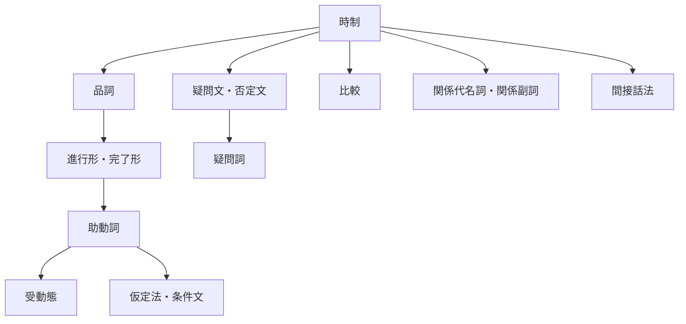

[Top](../../README.md) | [英語学習ガイド](../README.md)

# 文法学習ガイド

英語の文法を基礎から学習します。基本的な文の形から、応用的な表現へと段階的に学習します。

## 学習の流れ

### 1. 時制（動詞の変化）

| 文法項目 | 例文 | 日本語 |
|----------|------|--------|
| [一般動詞の現在形](11-tenses-regular-present/drill.md) | I `play` games. | 私はゲームをします。 |
| [一般動詞の過去形](12-tenses-regular-past/drill.md) | I `played` games. | 私はゲームをしました。 |
| [一般動詞の未来形](13-tenses-regular-future/drill.md) | I `will play` games. | 私はゲームをするでしょう。 |
| [be動詞の現在形](14-tenses-be-present/drill.md) | The game `is` fun. | ゲームは楽しいです。 |
| [be動詞の過去形](15-tenses-be-past/drill.md) | The game `was` fun. | ゲームは楽しかったです。 |
| [be動詞の未来形](16-tenses-be-future/drill.md) | The game `will be` fun. | ゲームは楽しくなるでしょう。 |
| [不規則動詞の過去形](17-tenses-irregular/drill.md) | I `bought` games. | 私はゲームを買いました。 |

### 2. 品詞（語の種類と使い方）

| 文法項目 | 例文 | 日本語 |
|----------|------|--------|
| [冠詞](18-articles/drill.md) | I play `a` game. / I play `the` game. | 私はゲームをします。/ 私はそのゲームをします。 |
| [形容詞](19-adjectives/drill.md) | I play `fun` games. | 私は楽しいゲームをします。 |
| [副詞](20-adverbs/drill.md) | I `always` play games. | 私はいつもゲームをします。 |
| [前置詞](21-prepositions/drill.md) | I play games `at` home. | 私は家でゲームをします。 |
| [接続詞](22-conjunctions/drill.md) | I play games `and` study English. | 私はゲームをして英語を勉強します。 |

### 3. 進行形・完了形

| 文法項目 | 例文 | 日本語 |
|----------|------|--------|
| [進行形](23-progressive/drill.md) | I `am playing` games. | 私はゲームをしています。 |
| [-ing形の作り方](24-progressive-ing/drill.md) | play → `playing`, run → `running` | — |
| [完了形](25-perfect/drill.md) | I `have played` games. | 私はゲームをしたことがあります。 |
| [過去分詞の変化](26-perfect-participles/drill.md) | play → `played`, go → `gone` | — |
| [完了形の用法](27-perfect-usage/drill.md) | I `have played` games `for` 3 years. | 私は3年間ゲームをしています。 |

### 4. 助動詞

| 文法項目 | 例文 | 日本語 |
|----------|------|--------|
| [助動詞の使い分け](28-modals-basic/drill.md) | I `can play` games. | 私はゲームができます。 |
| [助動詞の否定形](29-modals-negative/drill.md) | I `cannot play` games. | 私はゲームができません。 |
| [助動詞の過去形](30-modals-past/drill.md) | I `could play` games. | 私はゲームができました。 |

### 5. 受動態

| 文法項目 | 例文 | 日本語 |
|----------|------|--------|
| [受動態](31-passive/drill.md) | Games `are played` by me. | ゲームは私によってされます。 |
| [助動詞の受動態](32-passive-modals/drill.md) | Games `can be played` by anyone. | ゲームは誰でもできます。 |

### 6. 仮定法・条件文

| 文法項目 | 例文 | 日本語 |
|----------|------|--------|
| [条件文](33-conditionals-if/drill.md) | If I `had` time, I `would play` games. | もし時間があれば、ゲームをするのに。 |
| [I wish](34-conditionals-wish/drill.md) | I wish I `could play` games. | ゲームができたらいいのに。 |
| [unless](35-conditionals-unless/drill.md) | I play games `unless` I am busy. | 忙しくない限り、私はゲームをします。 |

### 7. 疑問文・否定文

| 文法項目 | 例文 | 日本語 |
|----------|------|--------|
| [疑問文](36-questions/drill.md) | `Do` you play games? | あなたはゲームをしますか？ |
| [否定文](37-negatives/drill.md) | I `do not play` games. | 私はゲームをしません。 |
| [疑問詞](38-questions-wh/drill.md) | `What` games do you play? | あなたは何のゲームをしますか？ |

### 8. 比較

| 文法項目 | 例文 | 日本語 |
|----------|------|--------|
| [比較級](39-comparatives-er/drill.md) | I play games `more` than you. | 私はあなたよりゲームをします。 |
| [最上級](40-comparatives-est/drill.md) | I play games `the most`. | 私が一番ゲームをします。 |
| [不規則な比較変化](41-comparatives-irregular/drill.md) | I play games `better` than you. | 私はあなたよりゲームが上手です。 |

### 9. 関係代名詞・関係副詞

| 文法項目 | 例文 | 日本語 |
|----------|------|--------|
| [主格の関係代名詞](42-relative-subject/drill.md) | The boy `who` plays games is my friend. | ゲームをする少年は私の友達です。 |
| [目的格の関係代名詞](43-relative-object/drill.md) | The game `which` I play is fun. | 私がするゲームは楽しいです。 |
| [所有格の関係代名詞](44-relative-possessive/drill.md) | The boy `whose` father plays games is my friend. | お父さんがゲームをする少年は私の友達です。 |
| [関係副詞](45-relative-adverb/drill.md) | The place `where` I play games is quiet. | 私がゲームをする場所は静かです。 |

### 10. 間接話法（話法の転換）

| 文法項目 | 例文 | 日本語 |
|----------|------|--------|
| [時制の一致](46-reported-tense/drill.md) | He said he `played` games. | 彼はゲームをしたと言いました。 |
| [疑問文の間接話法](47-reported-question/drill.md) | He asked if I `played` games. | 彼は私がゲームをするか尋ねました。 |
| [命令文の間接話法](48-reported-imperative/drill.md) | He told me `to play` games. | 彼は私にゲームをするよう言いました。 |
| [指示語の変化](49-reported-expressions/drill.md) | He said he would play games `the next day`. | 彼は翌日ゲームをすると言いました。 |

## 文法一覧（例文の変化）

同じ文（I play games.）を変化させた形で文法の違いを示します。

| 文法項目 | 例文 | 日本語 | 解説 |
|----------|------|--------|------|
| 現在形 | I `play` games. | 私はゲームをします。 | [解説](11-tenses-regular-present/guide.md) |
| 過去形 | I `played` games. | 私はゲームをしました。 | [解説](12-tenses-regular-past/guide.md) |
| 未来形 | I `will play` games. | 私はゲームをするでしょう。 | [解説](13-tenses-regular-future/guide.md) |
| be動詞 | The game `is` fun. | ゲームは楽しいです。 | [解説](14-tenses-be-present/guide.md) |
| 冠詞 | I play `a` game. | 私はゲームをします。 | [解説](18-articles/guide.md) |
| 形容詞 | I play `fun` games. | 私は楽しいゲームをします。 | [解説](19-adjectives/guide.md) |
| 副詞 | I `always` play games. | 私はいつもゲームをします。 | [解説](20-adverbs/guide.md) |
| 前置詞 | I play games `at` home. | 私は家でゲームをします。 | [解説](21-prepositions/guide.md) |
| 接続詞 | I play games `and` study. | 私はゲームをして勉強します。 | [解説](22-conjunctions/guide.md) |
| 現在進行形 | I `am playing` games. | 私はゲームをしています。 | [解説](23-progressive/guide.md) |
| 過去進行形 | I `was playing` games. | 私はゲームをしていました。 | [解説](23-progressive/guide.md) |
| 現在完了形 | I `have played` games. | 私はゲームをしたことがあります。 | [解説](25-perfect/guide.md) |
| 過去完了形 | I `had played` games. | 私はゲームをしていました。 | [解説](25-perfect/guide.md) |
| 助動詞（can） | I `can play` games. | 私はゲームができます。 | [解説](28-modals-basic/guide.md) |
| 助動詞の否定 | I `cannot play` games. | 私はゲームができません。 | [解説](29-modals-negative/guide.md) |
| 助動詞の過去 | I `could play` games. | 私はゲームができました。 | [解説](30-modals-past/guide.md) |
| 受動態 | Games `are played` by me. | ゲームは私によってされます。 | [解説](31-passive/guide.md) |
| 疑問文 | `Do` you play games? | あなたはゲームをしますか？ | [解説](36-questions/guide.md) |
| 否定文 | I `do not play` games. | 私はゲームをしません。 | [解説](37-negatives/guide.md) |
| 疑問詞 | `What` games do you play? | あなたは何のゲームをしますか？ | [解説](38-questions-wh/guide.md) |
| 仮定法 | If I `had` time, I `would play` games. | もし時間があれば、ゲームをするのに。 | [解説](33-conditionals-if/guide.md) |
| 比較級 | I play games `more` than you. | 私はあなたよりゲームをします。 | [解説](39-comparatives-er/guide.md) |
| 関係代名詞 | The game `which` I play is fun. | 私がするゲームは楽しいです。 | [解説](43-relative-object/guide.md) |
| 間接話法 | He said he `played` games. | 彼はゲームをしたと言いました。 | [解説](46-reported-tense/guide.md) |

## 学習の前後関係

## 文法ドリル一覧

| # | ドリル | 練習 | 解答 | 英作文 | 英作文解答 | 解説 | クイズ | 例 |
|---|--------|------|------|--------|-----------|------|--------|-----|
| 11 | 一般動詞の現在形 | [練習](11-tenses-regular-present/drill.md) | [解答](11-tenses-regular-present/answer.md) | [英作文](11-tenses-regular-present/writing.md) | [英作文解答](11-tenses-regular-present/writing-answer.md) | [解説](11-tenses-regular-present/guide.md) | [クイズ](../../quiz/index.html?subject=english&category=tenses-regular-present) | I `play` games. |
| 12 | 一般動詞の過去形 | [練習](12-tenses-regular-past/drill.md) | [解答](12-tenses-regular-past/answer.md) | [英作文](12-tenses-regular-past/writing.md) | [英作文解答](12-tenses-regular-past/writing-answer.md) | [解説](12-tenses-regular-past/guide.md) | [クイズ](../../quiz/index.html?subject=english&category=tenses-regular-past) | I `played` games. |
| 13 | 一般動詞の未来形 | [練習](13-tenses-regular-future/drill.md) | [解答](13-tenses-regular-future/answer.md) | [英作文](13-tenses-regular-future/writing.md) | [英作文解答](13-tenses-regular-future/writing-answer.md) | [解説](13-tenses-regular-future/guide.md) | [クイズ](../../quiz/index.html?subject=english&category=tenses-regular-future) | I `will play` games. |
| 14 | be動詞の現在形 | [練習](14-tenses-be-present/drill.md) | [解答](14-tenses-be-present/answer.md) | [英作文](14-tenses-be-present/writing.md) | [英作文解答](14-tenses-be-present/writing-answer.md) | [解説](14-tenses-be-present/guide.md) | [クイズ](../../quiz/index.html?subject=english&category=tenses-be-present) | The game `is` fun. |
| 15 | be動詞の過去形 | [練習](15-tenses-be-past/drill.md) | [解答](15-tenses-be-past/answer.md) | [英作文](15-tenses-be-past/writing.md) | [英作文解答](15-tenses-be-past/writing-answer.md) | [解説](15-tenses-be-past/guide.md) | [クイズ](../../quiz/index.html?subject=english&category=tenses-be-past) | The game `was` fun. |
| 16 | be動詞の未来形 | [練習](16-tenses-be-future/drill.md) | [解答](16-tenses-be-future/answer.md) | [英作文](16-tenses-be-future/writing.md) | [英作文解答](16-tenses-be-future/writing-answer.md) | [解説](16-tenses-be-future/guide.md) | [クイズ](../../quiz/index.html?subject=english&category=tenses-be-future) | The game `will be` fun. |
| 17 | 不規則動詞の過去形 | [練習](17-tenses-irregular/drill.md) | [解答](17-tenses-irregular/answer.md) | [英作文](17-tenses-irregular/writing.md) | [英作文解答](17-tenses-irregular/writing-answer.md) | [解説](17-tenses-irregular/guide.md) | [クイズ](../../quiz/index.html?subject=english&category=tenses-irregular) | I `bought` games. |
| 18 | 冠詞 | [練習](18-articles/drill.md) | [解答](18-articles/answer.md) | [英作文](18-articles/writing.md) | [英作文解答](18-articles/writing-answer.md) | [解説](18-articles/guide.md) | [クイズ](../../quiz/index.html?subject=english&category=articles) | I play `a` game. |
| 19 | 形容詞 | [練習](19-adjectives/drill.md) | [解答](19-adjectives/answer.md) | [英作文](19-adjectives/writing.md) | [英作文解答](19-adjectives/writing-answer.md) | [解説](19-adjectives/guide.md) | [クイズ](../../quiz/index.html?subject=english&category=adjectives) | I play `fun` games. |
| 20 | 副詞 | [練習](20-adverbs/drill.md) | [解答](20-adverbs/answer.md) | [英作文](20-adverbs/writing.md) | [英作文解答](20-adverbs/writing-answer.md) | [解説](20-adverbs/guide.md) | [クイズ](../../quiz/index.html?subject=english&category=adverbs) | I `always` play games. |
| 21 | 前置詞 | [練習](21-prepositions/drill.md) | [解答](21-prepositions/answer.md) | [英作文](21-prepositions/writing.md) | [英作文解答](21-prepositions/writing-answer.md) | [解説](21-prepositions/guide.md) | [クイズ](../../quiz/index.html?subject=english&category=prepositions) | I play games `at` home. |
| 22 | 接続詞 | [練習](22-conjunctions/drill.md) | [解答](22-conjunctions/answer.md) | [英作文](22-conjunctions/writing.md) | [英作文解答](22-conjunctions/writing-answer.md) | [解説](22-conjunctions/guide.md) | [クイズ](../../quiz/index.html?subject=english&category=conjunctions) | I play games `and` study. |
| 23 | 進行形 | [練習](23-progressive/drill.md) | [解答](23-progressive/answer.md) | [英作文](23-progressive/writing.md) | [英作文解答](23-progressive/writing-answer.md) | [解説](23-progressive/guide.md) | [クイズ](../../quiz/index.html?subject=english&category=progressive) | I `am playing` games. |
| 24 | -ing形の作り方 | [練習](24-progressive-ing/drill.md) | [解答](24-progressive-ing/answer.md) | [英作文](24-progressive-ing/writing.md) | [英作文解答](24-progressive-ing/writing-answer.md) | [解説](24-progressive-ing/guide.md) | [クイズ](../../quiz/index.html?subject=english&category=progressive-ing) | play→`playing` |
| 25 | 完了形 | [練習](25-perfect/drill.md) | [解答](25-perfect/answer.md) | [英作文](25-perfect/writing.md) | [英作文解答](25-perfect/writing-answer.md) | [解説](25-perfect/guide.md) | [クイズ](../../quiz/index.html?subject=english&category=perfect) | I `have played` games. |
| 26 | 過去分詞の変化 | [練習](26-perfect-participles/drill.md) | [解答](26-perfect-participles/answer.md) | [英作文](26-perfect-participles/writing.md) | [英作文解答](26-perfect-participles/writing-answer.md) | [解説](26-perfect-participles/guide.md) | [クイズ](../../quiz/index.html?subject=english&category=perfect-participles) | play→`played` |
| 27 | 完了形の用法 | [練習](27-perfect-usage/drill.md) | [解答](27-perfect-usage/answer.md) | [英作文](27-perfect-usage/writing.md) | [英作文解答](27-perfect-usage/writing-answer.md) | [解説](27-perfect-usage/guide.md) | [クイズ](../../quiz/index.html?subject=english&category=perfect-usage) | I `have played` games `for` 3 years. |
| 28 | 助動詞の使い分け | [練習](28-modals-basic/drill.md) | [解答](28-modals-basic/answer.md) | [英作文](28-modals-basic/writing.md) | [英作文解答](28-modals-basic/writing-answer.md) | [解説](28-modals-basic/guide.md) | [クイズ](../../quiz/index.html?subject=english&category=modals-basic) | I `can play` games. |
| 29 | 助動詞の否定形 | [練習](29-modals-negative/drill.md) | [解答](29-modals-negative/answer.md) | [英作文](29-modals-negative/writing.md) | [英作文解答](29-modals-negative/writing-answer.md) | [解説](29-modals-negative/guide.md) | [クイズ](../../quiz/index.html?subject=english&category=modals-negative) | I `cannot play` games. |
| 30 | 助動詞の過去形 | [練習](30-modals-past/drill.md) | [解答](30-modals-past/answer.md) | [英作文](30-modals-past/writing.md) | [英作文解答](30-modals-past/writing-answer.md) | [解説](30-modals-past/guide.md) | [クイズ](../../quiz/index.html?subject=english&category=modals-past) | I `could play` games. |
| 31 | 受動態 | [練習](31-passive/drill.md) | [解答](31-passive/answer.md) | [英作文](31-passive/writing.md) | [英作文解答](31-passive/writing-answer.md) | [解説](31-passive/guide.md) | [クイズ](../../quiz/index.html?subject=english&category=passive) | Games `are played` by me. |
| 32 | 助動詞の受動態 | [練習](32-passive-modals/drill.md) | [解答](32-passive-modals/answer.md) | [英作文](32-passive-modals/writing.md) | [英作文解答](32-passive-modals/writing-answer.md) | [解説](32-passive-modals/guide.md) | [クイズ](../../quiz/index.html?subject=english&category=passive-modals) | Games `can be played` by anyone. |
| 33 | 条件文 | [練習](33-conditionals-if/drill.md) | [解答](33-conditionals-if/answer.md) | [英作文](33-conditionals-if/writing.md) | [英作文解答](33-conditionals-if/writing-answer.md) | [解説](33-conditionals-if/guide.md) | [クイズ](../../quiz/index.html?subject=english&category=conditionals-if) | If I `had` time, I `would play` games. |
| 34 | I wish | [練習](34-conditionals-wish/drill.md) | [解答](34-conditionals-wish/answer.md) | [英作文](34-conditionals-wish/writing.md) | [英作文解答](34-conditionals-wish/writing-answer.md) | [解説](34-conditionals-wish/guide.md) | [クイズ](../../quiz/index.html?subject=english&category=conditionals-wish) | I wish I `could play` games. |
| 35 | unless | [練習](35-conditionals-unless/drill.md) | [解答](35-conditionals-unless/answer.md) | [英作文](35-conditionals-unless/writing.md) | [英作文解答](35-conditionals-unless/writing-answer.md) | [解説](35-conditionals-unless/guide.md) | [クイズ](../../quiz/index.html?subject=english&category=conditionals-unless) | I play games `unless` I am busy. |
| 36 | 疑問文 | [練習](36-questions/drill.md) | [解答](36-questions/answer.md) | [英作文](36-questions/writing.md) | [英作文解答](36-questions/writing-answer.md) | [解説](36-questions/guide.md) | [クイズ](../../quiz/index.html?subject=english&category=questions) | `Do` you play games? |
| 37 | 否定文 | [練習](37-negatives/drill.md) | [解答](37-negatives/answer.md) | [英作文](37-negatives/writing.md) | [英作文解答](37-negatives/writing-answer.md) | [解説](37-negatives/guide.md) | [クイズ](../../quiz/index.html?subject=english&category=negatives) | I `do not play` games. |
| 38 | 疑問詞 | [練習](38-questions-wh/drill.md) | [解答](38-questions-wh/answer.md) | [英作文](38-questions-wh/writing.md) | [英作文解答](38-questions-wh/writing-answer.md) | [解説](38-questions-wh/guide.md) | [クイズ](../../quiz/index.html?subject=english&category=questions-wh) | `What` games do you play? |
| 39 | 比較級 | [練習](39-comparatives-er/drill.md) | [解答](39-comparatives-er/answer.md) | [英作文](39-comparatives-er/writing.md) | [英作文解答](39-comparatives-er/writing-answer.md) | [解説](39-comparatives-er/guide.md) | [クイズ](../../quiz/index.html?subject=english&category=comparatives-er) | I play games `more` than you. |
| 40 | 最上級 | [練習](40-comparatives-est/drill.md) | [解答](40-comparatives-est/answer.md) | [英作文](40-comparatives-est/writing.md) | [英作文解答](40-comparatives-est/writing-answer.md) | [解説](40-comparatives-est/guide.md) | [クイズ](../../quiz/index.html?subject=english&category=comparatives-est) | I play games `the most`. |
| 41 | 不規則な比較変化 | [練習](41-comparatives-irregular/drill.md) | [解答](41-comparatives-irregular/answer.md) | [英作文](41-comparatives-irregular/writing.md) | [英作文解答](41-comparatives-irregular/writing-answer.md) | [解説](41-comparatives-irregular/guide.md) | [クイズ](../../quiz/index.html?subject=english&category=comparatives-irregular) | I play games `better` than you. |
| 42 | 主格の関係代名詞 | [練習](42-relative-subject/drill.md) | [解答](42-relative-subject/answer.md) | [英作文](42-relative-subject/writing.md) | [英作文解答](42-relative-subject/writing-answer.md) | [解説](42-relative-subject/guide.md) | [クイズ](../../quiz/index.html?subject=english&category=relative-subject) | The boy `who` plays games is my friend. |
| 43 | 目的格の関係代名詞 | [練習](43-relative-object/drill.md) | [解答](43-relative-object/answer.md) | [英作文](43-relative-object/writing.md) | [英作文解答](43-relative-object/writing-answer.md) | [解説](43-relative-object/guide.md) | [クイズ](../../quiz/index.html?subject=english&category=relative-object) | The game `which` I play is fun. |
| 44 | 所有格の関係代名詞 | [練習](44-relative-possessive/drill.md) | [解答](44-relative-possessive/answer.md) | [英作文](44-relative-possessive/writing.md) | [英作文解答](44-relative-possessive/writing-answer.md) | [解説](44-relative-possessive/guide.md) | [クイズ](../../quiz/index.html?subject=english&category=relative-possessive) | The boy `whose` father plays games is my friend. |
| 45 | 関係副詞 | [練習](45-relative-adverb/drill.md) | [解答](45-relative-adverb/answer.md) | [英作文](45-relative-adverb/writing.md) | [英作文解答](45-relative-adverb/writing-answer.md) | [解説](45-relative-adverb/guide.md) | [クイズ](../../quiz/index.html?subject=english&category=relative-adverb) | The place `where` I play games is quiet. |
| 46 | 時制の一致 | [練習](46-reported-tense/drill.md) | [解答](46-reported-tense/answer.md) | [英作文](46-reported-tense/writing.md) | [英作文解答](46-reported-tense/writing-answer.md) | [解説](46-reported-tense/guide.md) | [クイズ](../../quiz/index.html?subject=english&category=reported-tense) | He said he `played` games. |
| 47 | 疑問文の間接話法 | [練習](47-reported-question/drill.md) | [解答](47-reported-question/answer.md) | [英作文](47-reported-question/writing.md) | [英作文解答](47-reported-question/writing-answer.md) | [解説](47-reported-question/guide.md) | [クイズ](../../quiz/index.html?subject=english&category=reported-question) | He asked if I `played` games. |
| 48 | 命令文の間接話法 | [練習](48-reported-imperative/drill.md) | [解答](48-reported-imperative/answer.md) | [英作文](48-reported-imperative/writing.md) | [英作文解答](48-reported-imperative/writing-answer.md) | [解説](48-reported-imperative/guide.md) | [クイズ](../../quiz/index.html?subject=english&category=reported-imperative) | He told me `to play` games. |
| 49 | 指示語の変化 | [練習](49-reported-expressions/drill.md) | [解答](49-reported-expressions/answer.md) | [英作文](49-reported-expressions/writing.md) | [英作文解答](49-reported-expressions/writing-answer.md) | [解説](49-reported-expressions/guide.md) | [クイズ](../../quiz/index.html?subject=english&category=reported-expressions) | `this` game→`that` game |
