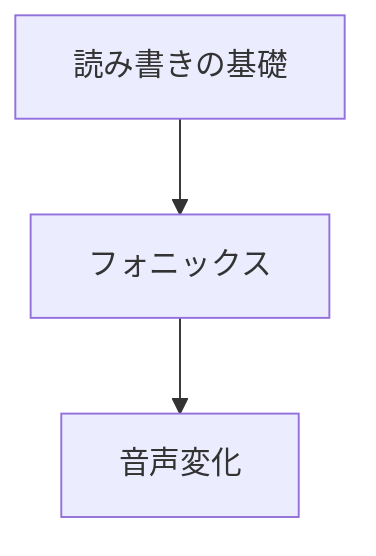

[Top](../../README.md) | [英語学習ガイド](../README.md)

# 発音学習ガイド

英語の発音を基礎から学習します。「読み書きの基礎」→「フォニックス」→「音声変化」の順に進みます。

## 学習の流れ

### 1. 読み書きの基礎

- [アルファベット](01-alphabet/drill.md) — 大文字・小文字と読み仮名
- [50音](02-50on/drill.md) — ひらがなとローマ字の対応

### 2. フォニックス（音と文字の関係）

- [フォニックス（1文字）](03-phonics-1letter/drill.md) — 1文字の基本的な音
- [フォニックス（2文字・マジックE）](04-phonics-2letter/drill.md) — 2文字の組み合わせの音
- [フォニックス（3文字）](05-phonics-3letter/drill.md) — 3文字の組み合わせの音

### 3. 音声変化（リスニング・スピーキング）

- [リンキング・リダクション](06-linking-reduction/drill.md) — 音声変化の基礎
- [リンキング](07-linking/drill.md) — 音がつながる現象
- [リダクション](08-reduction/drill.md) — 音が弱くなる・消える現象
- [フラッピング](09-flapping/drill.md) — t/d がラ行の音に変わる現象
- [アシミレーション](10-assimilation/drill.md) — 隣り合う音が影響し合う現象

## 学習の前後関係

## 発音ドリル一覧

| # | ドリル | 練習 | 解答 | 解説 | クイズ | 例 |
|---|--------|------|------|------|--------|-----|
| 01 | アルファベット（大文字・小文字と読み仮名） | [練習](01-alphabet/drill.md) | [解答](01-alphabet/answer.md) | [解説](01-alphabet/guide.md) | [クイズ](../../quiz/index.html?subject=english&category=alphabet) | A(えー) B(びー) |
| 02 | 50音（ひらがなとローマ字） | [練習](02-50on/drill.md) | [解答](02-50on/answer.md) | [解説](02-50on/guide.md) | [クイズ](../../quiz/index.html?subject=english&category=50on) | あ=a い=i う=u |
| 03 | フォニックス（1文字） | [練習](03-phonics-1letter/drill.md) | [解答](03-phonics-1letter/answer.md) | [解説](03-phonics-1letter/guide.md) | [クイズ](../../quiz/index.html?subject=english&category=phonics-1) | `p`→/p/ (play) |
| 04 | フォニックス（2文字・マジックE） | [練習](04-phonics-2letter/drill.md) | [解答](04-phonics-2letter/answer.md) | [解説](04-phonics-2letter/guide.md) | [クイズ](../../quiz/index.html?subject=english&category=phonics-2) | `ay`→/eɪ/ (play) |
| 05 | フォニックス（3文字） | [練習](05-phonics-3letter/drill.md) | [解答](05-phonics-3letter/answer.md) | [解説](05-phonics-3letter/guide.md) | [クイズ](../../quiz/index.html?subject=english&category=phonics-3) | `igh`→/aɪ/ (night) |
| 06 | リンキング・リダクション | [練習](06-linking-reduction/drill.md) | [解答](06-linking-reduction/answer.md) | [解説](06-linking-reduction/guide.md) | | (まとめ) |
| 07 | リンキング | [練習](07-linking/drill.md) | [解答](07-linking/answer.md) | [解説](07-linking/guide.md) | [クイズ](../../quiz/index.html?subject=english&category=linking) | play\_it→プレイ イッ |
| 08 | リダクション | [練習](08-reduction/drill.md) | [解答](08-reduction/answer.md) | [解説](08-reduction/guide.md) | [クイズ](../../quiz/index.html?subject=english&category=reduction) | for→/fər/ |
| 09 | フラッピング | [練習](09-flapping/drill.md) | [解答](09-flapping/answer.md) | [解説](09-flapping/guide.md) | [クイズ](../../quiz/index.html?subject=english&category=flapping) | water→ウォダー |
| 10 | アシミレーション | [練習](10-assimilation/drill.md) | [解答](10-assimilation/answer.md) | [解説](10-assimilation/guide.md) | [クイズ](../../quiz/index.html?subject=english&category=assimilation) | meet you→ミーチュー |
