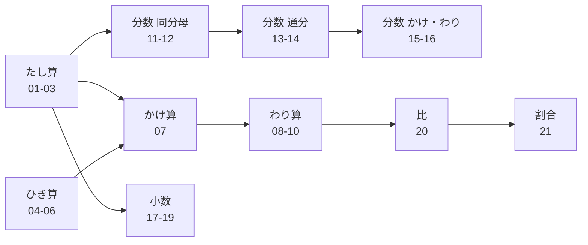
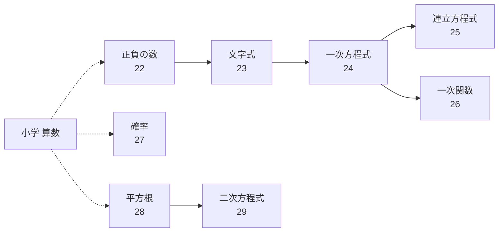
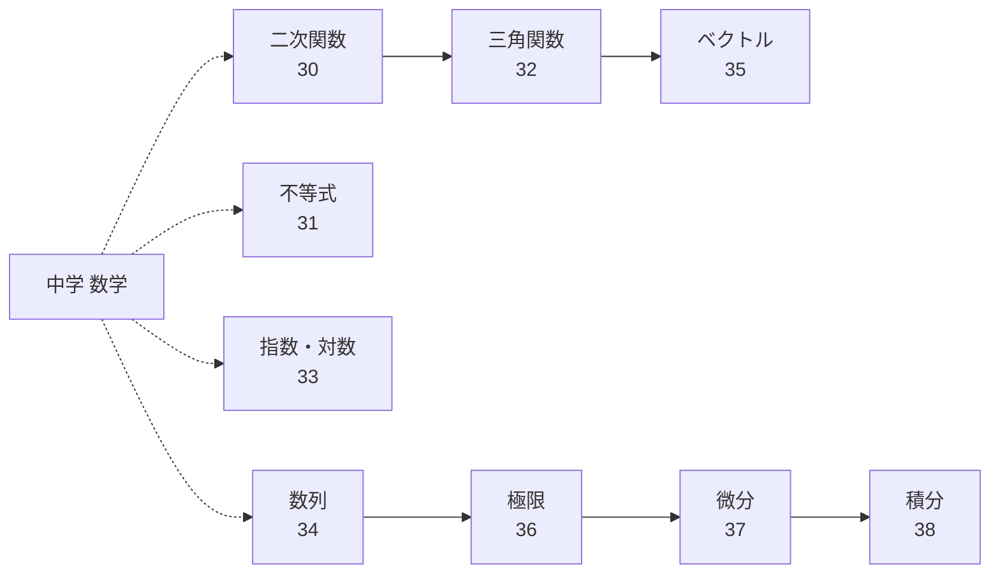

# 数学ドリル

[ドリル一覧へ戻る](../README.md)

## 学習の流れ

### 🏫 小学校（算数の基礎）

#### たし算・ひき算（1年）

- [01 たし算（くり上がりなし）](01-addition-no-carry/drill.md) → [02 たし算（くり上がりあり）](02-addition-carry/drill.md) → [03 たし算（まとめ）](03-addition-mixed/drill.md)
- [04 ひき算（くり下がりなし）](04-subtraction-no-borrow/drill.md) → [05 ひき算（くり下がりあり）](05-subtraction-borrow/drill.md) → [06 ひき算（まとめ）](06-subtraction-mixed/drill.md)

#### かけ算・わり算（2〜3年）

- [07 かけ算](07-multiplication/drill.md) → [08 わり算（あまりなし）](08-division-no-remainder/drill.md) → [09 わり算（あまりあり）](09-division-remainder/drill.md) → [10 わり算（まとめ）](10-division-mixed/drill.md)

#### 分数（4〜6年）

- [11 分数のたし算（同分母）](11-fractions-same-add/drill.md) → [12 分数のひき算（同分母）](12-fractions-same-sub/drill.md) → [13 分数のたし算（通分あり）](13-fractions-diff-add/drill.md) → [14 分数のひき算（通分あり）](14-fractions-diff-sub/drill.md) → [15 分数のかけ算](15-fractions-multiply/drill.md) → [16 分数のわり算](16-fractions-divide/drill.md)

#### 小数（4〜5年）

- [17 小数のたし算](17-decimals-addition/drill.md) → [18 小数のひき算](18-decimals-subtraction/drill.md) → [19 小数のかけ算](19-decimals-multiplication/drill.md)

#### 比・割合（5〜6年）

- [20 比](20-ratio/drill.md) → [21 割合](21-percentage/drill.md)

### 🏫 中学校（代数と確率）

#### 正負の数・文字式・方程式（1年）

- [22 正負の数](22-positive-negative/drill.md) → [23 文字式](23-algebraic-expressions/drill.md) → [24 一次方程式](24-linear-eq/drill.md)

#### 連立方程式・関数・確率（2年）

- [25 連立方程式](25-simultaneous-eq/drill.md) → [26 一次関数](26-linear-func/drill.md)
- [27 確率](27-probability/drill.md)

#### 平方根・二次方程式（3年）

- [28 平方根](28-square-roots/drill.md) → [29 二次方程式](29-quadratic-eq/drill.md)

### 🏫 高校（関数・解析・幾何）

#### 二次関数・不等式（1年）

- [30 二次関数](30-quadratic-func/drill.md) → [31 不等式](31-inequalities/drill.md)

#### 三角関数・指数対数・数列・ベクトル（2年）

- [32 三角関数](32-trigonometry/drill.md) → [33 指数・対数](33-exponents-logarithms/drill.md)
- [34 数列](34-sequences/drill.md) → [35 ベクトル](35-vectors/drill.md)

#### 極限・微分・積分（3年）

- [36 極限](36-limits/drill.md) → [37 微分](37-differentiation/drill.md) → [38 積分](38-integration/drill.md)

## 学習の前後関係

### 小学校（算数の基礎）

### 中学校（代数と確率）

### 高校（関数・解析・幾何）

## コンテンツ一覧

| # | 内容 | 参考学年 | 練習 | 回答 | 解説 | 例 |
|---|------|----------|------|------|------|-----|
| 01 | たし算（くり上がりなし） | 小学1年 | [練習](01-addition-no-carry/drill.md) | [回答](01-addition-no-carry/answer.md) | [解説](01-addition-no-carry/guide.md) | 3 + 4 = 7 |
| 02 | たし算（くり上がりあり） | 小学1年 | [練習](02-addition-carry/drill.md) | [回答](02-addition-carry/answer.md) | [解説](02-addition-carry/guide.md) | 7 + 8 = 15 |
| 03 | たし算（まとめ） | 小学1年 | [練習](03-addition-mixed/drill.md) | [回答](03-addition-mixed/answer.md) | [解説](03-addition-mixed/guide.md) | 6 + 9 = 15 |
| 04 | ひき算（くり下がりなし） | 小学1年 | [練習](04-subtraction-no-borrow/drill.md) | [回答](04-subtraction-no-borrow/answer.md) | [解説](04-subtraction-no-borrow/guide.md) | 8 - 3 = 5 |
| 05 | ひき算（くり下がりあり） | 小学1年 | [練習](05-subtraction-borrow/drill.md) | [回答](05-subtraction-borrow/answer.md) | [解説](05-subtraction-borrow/guide.md) | 13 - 7 = 6 |
| 06 | ひき算（まとめ） | 小学1年 | [練習](06-subtraction-mixed/drill.md) | [回答](06-subtraction-mixed/answer.md) | [解説](06-subtraction-mixed/guide.md) | 15 - 8 = 7 |
| 07 | かけ算 | 小学2年 | [練習](07-multiplication/drill.md) | [回答](07-multiplication/answer.md) | [解説](07-multiplication/guide.md) | 6 × 7 = 42 |
| 08 | わり算（あまりなし） | 小学3年 | [練習](08-division-no-remainder/drill.md) | [回答](08-division-no-remainder/answer.md) | [解説](08-division-no-remainder/guide.md) | 12 ÷ 4 = 3 |
| 09 | わり算（あまりあり） | 小学3年 | [練習](09-division-remainder/drill.md) | [回答](09-division-remainder/answer.md) | [解説](09-division-remainder/guide.md) | 17 ÷ 5 = 3…2 |
| 10 | わり算（まとめ） | 小学3年 | [練習](10-division-mixed/drill.md) | [回答](10-division-mixed/answer.md) | [解説](10-division-mixed/guide.md) | 23 ÷ 4 = 5…3 |
| 11 | 分数のたし算（同分母） | 小学4年 | [練習](11-fractions-same-add/drill.md) | [回答](11-fractions-same-add/answer.md) | [解説](11-fractions-same-add/guide.md) | 1/5 + 2/5 = 3/5 |
| 12 | 分数のひき算（同分母） | 小学4年 | [練習](12-fractions-same-sub/drill.md) | [回答](12-fractions-same-sub/answer.md) | [解説](12-fractions-same-sub/guide.md) | 4/7 - 2/7 = 2/7 |
| 13 | 分数のたし算（通分あり） | 小学5年 | [練習](13-fractions-diff-add/drill.md) | [回答](13-fractions-diff-add/answer.md) | [解説](13-fractions-diff-add/guide.md) | 1/2 + 1/3 = 5/6 |
| 14 | 分数のひき算（通分あり） | 小学5年 | [練習](14-fractions-diff-sub/drill.md) | [回答](14-fractions-diff-sub/answer.md) | [解説](14-fractions-diff-sub/guide.md) | 3/4 - 1/3 = 5/12 |
| 15 | 分数のかけ算 | 小学6年 | [練習](15-fractions-multiply/drill.md) | [回答](15-fractions-multiply/answer.md) | [解説](15-fractions-multiply/guide.md) | 2/3 × 3/4 = 1/2 |
| 16 | 分数のわり算 | 小学6年 | [練習](16-fractions-divide/drill.md) | [回答](16-fractions-divide/answer.md) | [解説](16-fractions-divide/guide.md) | 2/3 ÷ 4/5 = 5/6 |
| 17 | 小数のたし算 | 小学4年 | [練習](17-decimals-addition/drill.md) | [回答](17-decimals-addition/answer.md) | [解説](17-decimals-addition/guide.md) | 1.2 + 3.4 = 4.6 |
| 18 | 小数のひき算 | 小学4年 | [練習](18-decimals-subtraction/drill.md) | [回答](18-decimals-subtraction/answer.md) | [解説](18-decimals-subtraction/guide.md) | 5.3 - 2.1 = 3.2 |
| 19 | 小数のかけ算 | 小学5年 | [練習](19-decimals-multiplication/drill.md) | [回答](19-decimals-multiplication/answer.md) | [解説](19-decimals-multiplication/guide.md) | 0.3 × 0.4 = 0.12 |
| 20 | 比 | 小学6年 | [練習](20-ratio/drill.md) | [回答](20-ratio/answer.md) | [解説](20-ratio/guide.md) | 4:6 = 2:3 |
| 21 | 割合 | 小学5年 | [練習](21-percentage/drill.md) | [回答](21-percentage/answer.md) | [解説](21-percentage/guide.md) | 60人の30% = 18人 |
| 22 | 正負の数 | 中学1年 | [練習](22-positive-negative/drill.md) | [回答](22-positive-negative/answer.md) | [解説](22-positive-negative/guide.md) | (-3) + (+5) = 2 |
| 23 | 文字式 | 中学1年 | [練習](23-algebraic-expressions/drill.md) | [回答](23-algebraic-expressions/answer.md) | [解説](23-algebraic-expressions/guide.md) | 3a + 2a = 5a |
| 24 | 一次方程式 | 中学1年 | [練習](24-linear-eq/drill.md) | [回答](24-linear-eq/answer.md) | [解説](24-linear-eq/guide.md) | 2x + 3 = 7 → x = 2 |
| 25 | 連立方程式 | 中学2年 | [練習](25-simultaneous-eq/drill.md) | [回答](25-simultaneous-eq/answer.md) | [解説](25-simultaneous-eq/guide.md) | x+y=5, x-y=1 → x=3,y=2 |
| 26 | 一次関数 | 中学2年 | [練習](26-linear-func/drill.md) | [回答](26-linear-func/answer.md) | [解説](26-linear-func/guide.md) | y = 2x + 1 |
| 27 | 確率 | 中学2年 | [練習](27-probability/drill.md) | [回答](27-probability/answer.md) | [解説](27-probability/guide.md) | サイコロで偶数 = 3/6 = 1/2 |
| 28 | 平方根 | 中学3年 | [練習](28-square-roots/drill.md) | [回答](28-square-roots/answer.md) | [解説](28-square-roots/guide.md) | √12 = 2√3 |
| 29 | 二次方程式 | 中学3年 | [練習](29-quadratic-eq/drill.md) | [回答](29-quadratic-eq/answer.md) | [解説](29-quadratic-eq/guide.md) | x²-5x+6=0 → x=2,3 |
| 30 | 二次関数 | 高校1年 | [練習](30-quadratic-func/drill.md) | [回答](30-quadratic-func/answer.md) | [解説](30-quadratic-func/guide.md) | y = x² - 4x + 3 |
| 31 | 不等式 | 高校1年 | [練習](31-inequalities/drill.md) | [回答](31-inequalities/answer.md) | [解説](31-inequalities/guide.md) | 2x - 3 > 5 → x > 4 |
| 32 | 三角関数 | 高校2年 | [練習](32-trigonometry/drill.md) | [回答](32-trigonometry/answer.md) | [解説](32-trigonometry/guide.md) | sin30° = 1/2 |
| 33 | 指数・対数 | 高校2年 | [練習](33-exponents-logarithms/drill.md) | [回答](33-exponents-logarithms/answer.md) | [解説](33-exponents-logarithms/guide.md) | log₂8 = 3 |
| 34 | 数列 | 高校2年 | [練習](34-sequences/drill.md) | [回答](34-sequences/answer.md) | [解説](34-sequences/guide.md) | 1,3,5,7,… → aₙ=2n-1 |
| 35 | ベクトル | 高校2年 | [練習](35-vectors/drill.md) | [回答](35-vectors/answer.md) | [解説](35-vectors/guide.md) | →a=(1,2), →b=(3,4) → →a+→b=(4,6) |
| 36 | 極限 | 高校3年 | [練習](36-limits/drill.md) | [回答](36-limits/answer.md) | [解説](36-limits/guide.md) | lim(n→∞) 1/n = 0 |
| 37 | 微分 | 高校3年 | [練習](37-differentiation/drill.md) | [回答](37-differentiation/answer.md) | [解説](37-differentiation/guide.md) | f(x)=x³ → f'(x)=3x² |
| 38 | 積分 | 高校3年 | [練習](38-integration/drill.md) | [回答](38-integration/answer.md) | [解説](38-integration/guide.md) | ∫2xdx = x² + C |
