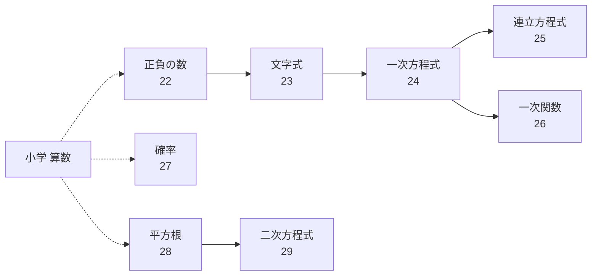

[Top](../../README.md) | [数学ドリル](../README.md)

# 代数学習ガイド

中学校で学ぶ代数を学習します。「正負の数・文字式・方程式」→「関数」→「確率・平方根」の順に進みます。

## 学習の流れ

### 1. 正負の数・文字式・方程式（中学1年）

- [正負の数](22-positive-negative/guide.md) — マイナスの数を含む計算
- [文字式](23-algebraic-expressions/guide.md) — 文字を使った式の計算
- [一次方程式](24-linear-eq/guide.md) — 一次方程式を解く

### 2. 連立方程式・関数（中学2年）

- [連立方程式](25-simultaneous-eq/guide.md) — 2つの方程式を同時に解く
- [一次関数](26-linear-func/guide.md) — 直線のグラフと式

### 3. 確率・平方根・二次方程式（中学2〜3年）

- [確率](27-probability/guide.md) — 起こりやすさを数で表す
- [平方根](28-square-roots/guide.md) — √（ルート）の計算
- [二次方程式](29-quadratic-eq/guide.md) — 二次方程式を解く

## 学習の前後関係

## 代数ドリル一覧

| # | 内容 | 内容紹介 | 参考学年 | 解説 | 例 |
|---|------|------|----------|------|-----|
| 22 | 正負の数 | 正と負の数の四則計算の方法を学ぶ | 中学1年 | [解説](22-positive-negative/guide.md) | (-3) + (+5) = 2 |
| 23 | 文字式 | 文字を使った式の表し方・計算ルールを身につける | 中学1年 | [解説](23-algebraic-expressions/guide.md) | 3a + 2a = 5a |
| 24 | 一次方程式 | 移項を使ってxを求める一次方程式の解き方を学ぶ | 中学1年 | [解説](24-linear-eq/guide.md) | 2x + 3 = 7 → x = 2 |
| 25 | 連立方程式 | 加減法・代入法で2つの方程式を同時に解く方法を学ぶ | 中学2年 | [解説](25-simultaneous-eq/guide.md) | x+y=5, x-y=1 → x=3,y=2 |
| 26 | 一次関数 | y=ax+bのグラフの傾き・切片と式の求め方を学ぶ | 中学2年 | [解説](26-linear-func/guide.md) | y = 2x + 1 |
| 27 | 確率 | 場合の数を数えて確率を求める基本的な方法を学ぶ | 中学2年 | [解説](27-probability/guide.md) | サイコロで偶数 = 3/6 = 1/2 |
| 28 | 平方根 | √（ルート）の意味と計算方法を学ぶ | 中学3年 | [解説](28-square-roots/guide.md) | √12 = 2√3 |
| 29 | 二次方程式 | 因数分解・解の公式を使って二次方程式を解く方法を学ぶ | 中学3年 | [解説](29-quadratic-eq/guide.md) | x²-5x+6=0 → x=2,3 |
