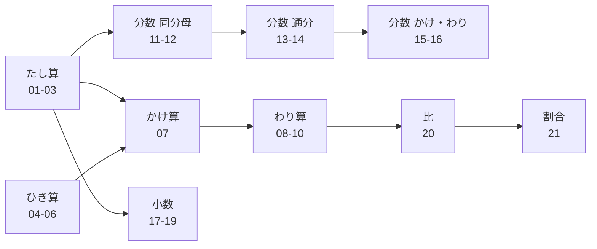

[Top](../../README.md) | [数学ドリル](../README.md)

# 算数・基本計算ガイド

小学校で学ぶ算数の基本計算を学習します。「たし算・ひき算」→「かけ算・わり算」→「分数・小数」→「比・割合」の順に進みます。

## 学習の流れ

### 1. たし算・ひき算（小学1年）

- [たし算（くり上がりなし）](01-addition-no-carry/drill.md) — 1けたのたし算の基本
- [たし算（くり上がりあり）](02-addition-carry/drill.md) — くり上がりのあるたし算
- [たし算（まとめ）](03-addition-mixed/drill.md) — くり上がりあり・なしの混合練習
- [ひき算（くり下がりなし）](04-subtraction-no-borrow/drill.md) — 1けたのひき算の基本
- [ひき算（くり下がりあり）](05-subtraction-borrow/drill.md) — くり下がりのあるひき算
- [ひき算（まとめ）](06-subtraction-mixed/drill.md) — くり下がりあり・なしの混合練習

### 2. かけ算・わり算（小学2〜3年）

- [かけ算](07-multiplication/drill.md) — 九九の練習
- [わり算（あまりなし）](08-division-no-remainder/drill.md) — 基本のわり算
- [わり算（あまりあり）](09-division-remainder/drill.md) — あまりのあるわり算
- [わり算（まとめ）](10-division-mixed/drill.md) — あまりあり・なしの混合練習

### 3. 分数（小学4〜6年）

- [分数のたし算（同分母）](11-fractions-same-add/drill.md) — 分母が同じ分数のたし算
- [分数のひき算（同分母）](12-fractions-same-sub/drill.md) — 分母が同じ分数のひき算
- [分数のたし算（通分あり）](13-fractions-diff-add/drill.md) — 分母が異なる分数のたし算
- [分数のひき算（通分あり）](14-fractions-diff-sub/drill.md) — 分母が異なる分数のひき算
- [分数のかけ算](15-fractions-multiply/drill.md) — 分数のかけ算
- [分数のわり算](16-fractions-divide/drill.md) — 分数のわり算

### 4. 小数（小学4〜5年）

- [小数のたし算](17-decimals-addition/drill.md) — 小数のたし算
- [小数のひき算](18-decimals-subtraction/drill.md) — 小数のひき算
- [小数のかけ算](19-decimals-multiplication/drill.md) — 小数のかけ算

### 5. 比・割合（小学5〜6年）

- [比](20-ratio/drill.md) — 比の計算
- [割合](21-percentage/drill.md) — 百分率・割合の計算

## 学習の前後関係

## 算数ドリル一覧

| # | 内容 | 参考学年 | 練習 | 解答 | 解説 | 例 |
|---|------|----------|------|------|------|-----|
| 01 | たし算（くり上がりなし） | 小学1年 | [練習](01-addition-no-carry/drill.md) | [解答](01-addition-no-carry/answer.md) | [解説](01-addition-no-carry/guide.md) | 3 + 4 = 7 |
| 02 | たし算（くり上がりあり） | 小学1年 | [練習](02-addition-carry/drill.md) | [解答](02-addition-carry/answer.md) | [解説](02-addition-carry/guide.md) | 7 + 8 = 15 |
| 03 | たし算（まとめ） | 小学1年 | [練習](03-addition-mixed/drill.md) | [解答](03-addition-mixed/answer.md) | [解説](03-addition-mixed/guide.md) | 6 + 9 = 15 |
| 04 | ひき算（くり下がりなし） | 小学1年 | [練習](04-subtraction-no-borrow/drill.md) | [解答](04-subtraction-no-borrow/answer.md) | [解説](04-subtraction-no-borrow/guide.md) | 8 - 3 = 5 |
| 05 | ひき算（くり下がりあり） | 小学1年 | [練習](05-subtraction-borrow/drill.md) | [解答](05-subtraction-borrow/answer.md) | [解説](05-subtraction-borrow/guide.md) | 13 - 7 = 6 |
| 06 | ひき算（まとめ） | 小学1年 | [練習](06-subtraction-mixed/drill.md) | [解答](06-subtraction-mixed/answer.md) | [解説](06-subtraction-mixed/guide.md) | 15 - 8 = 7 |
| 07 | かけ算 | 小学2年 | [練習](07-multiplication/drill.md) | [解答](07-multiplication/answer.md) | [解説](07-multiplication/guide.md) | 6 × 7 = 42 |
| 08 | わり算（あまりなし） | 小学3年 | [練習](08-division-no-remainder/drill.md) | [解答](08-division-no-remainder/answer.md) | [解説](08-division-no-remainder/guide.md) | 12 ÷ 4 = 3 |
| 09 | わり算（あまりあり） | 小学3年 | [練習](09-division-remainder/drill.md) | [解答](09-division-remainder/answer.md) | [解説](09-division-remainder/guide.md) | 17 ÷ 5 = 3…2 |
| 10 | わり算（まとめ） | 小学3年 | [練習](10-division-mixed/drill.md) | [解答](10-division-mixed/answer.md) | [解説](10-division-mixed/guide.md) | 23 ÷ 4 = 5…3 |
| 11 | 分数のたし算（同分母） | 小学4年 | [練習](11-fractions-same-add/drill.md) | [解答](11-fractions-same-add/answer.md) | [解説](11-fractions-same-add/guide.md) | 1/5 + 2/5 = 3/5 |
| 12 | 分数のひき算（同分母） | 小学4年 | [練習](12-fractions-same-sub/drill.md) | [解答](12-fractions-same-sub/answer.md) | [解説](12-fractions-same-sub/guide.md) | 4/7 - 2/7 = 2/7 |
| 13 | 分数のたし算（通分あり） | 小学5年 | [練習](13-fractions-diff-add/drill.md) | [解答](13-fractions-diff-add/answer.md) | [解説](13-fractions-diff-add/guide.md) | 1/2 + 1/3 = 5/6 |
| 14 | 分数のひき算（通分あり） | 小学5年 | [練習](14-fractions-diff-sub/drill.md) | [解答](14-fractions-diff-sub/answer.md) | [解説](14-fractions-diff-sub/guide.md) | 3/4 - 1/3 = 5/12 |
| 15 | 分数のかけ算 | 小学6年 | [練習](15-fractions-multiply/drill.md) | [解答](15-fractions-multiply/answer.md) | [解説](15-fractions-multiply/guide.md) | 2/3 × 3/4 = 1/2 |
| 16 | 分数のわり算 | 小学6年 | [練習](16-fractions-divide/drill.md) | [解答](16-fractions-divide/answer.md) | [解説](16-fractions-divide/guide.md) | 2/3 ÷ 4/5 = 5/6 |
| 17 | 小数のたし算 | 小学4年 | [練習](17-decimals-addition/drill.md) | [解答](17-decimals-addition/answer.md) | [解説](17-decimals-addition/guide.md) | 1.2 + 3.4 = 4.6 |
| 18 | 小数のひき算 | 小学4年 | [練習](18-decimals-subtraction/drill.md) | [解答](18-decimals-subtraction/answer.md) | [解説](18-decimals-subtraction/guide.md) | 5.3 - 2.1 = 3.2 |
| 19 | 小数のかけ算 | 小学5年 | [練習](19-decimals-multiplication/drill.md) | [解答](19-decimals-multiplication/answer.md) | [解説](19-decimals-multiplication/guide.md) | 0.3 × 0.4 = 0.12 |
| 20 | 比 | 小学6年 | [練習](20-ratio/drill.md) | [解答](20-ratio/answer.md) | [解説](20-ratio/guide.md) | 4:6 = 2:3 |
| 21 | 割合 | 小学5年 | [練習](21-percentage/drill.md) | [解答](21-percentage/answer.md) | [解説](21-percentage/guide.md) | 60人の30% = 18人 |
