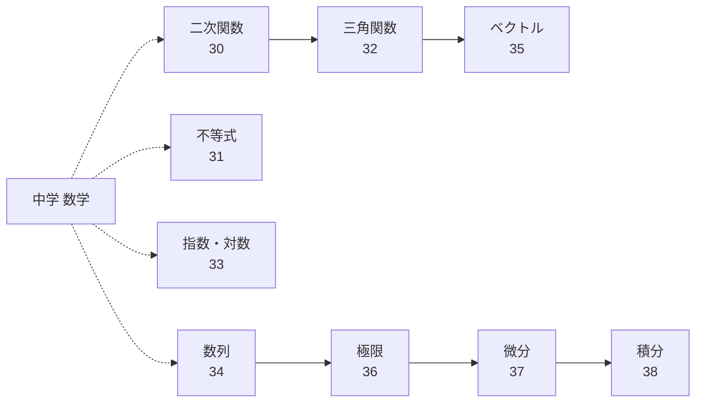

[Top](../../README.md) | [数学ドリル](../README.md)

# 解析・高校数学ガイド

高校で学ぶ数学を学習します。「二次関数・不等式」→「三角関数・指数対数・数列・ベクトル」→「極限・微分・積分」の順に進みます。

## 学習の流れ

### 1. 二次関数・不等式（高校1年）

- [二次関数](30-quadratic-func/drill.md) — 放物線のグラフと式
- [不等式](31-inequalities/drill.md) — 不等式を解く

### 2. 三角関数・指数対数・数列・ベクトル（高校2年）

- [三角関数](32-trigonometry/drill.md) — sin、cos、tanの計算
- [指数・対数](33-exponents-logarithms/drill.md) — 指数と対数の計算
- [数列](34-sequences/drill.md) — 数の並びの規則性
- [ベクトル](35-vectors/drill.md) — 向きと大きさを持つ量

### 3. 極限・微分・積分（高校3年）

- [極限](36-limits/drill.md) — 限りなく近づく値
- [微分](37-differentiation/drill.md) — 変化の割合を求める
- [積分](38-integration/drill.md) — 面積を求める

## 学習の前後関係

## 解析・高校数学ドリル一覧

| # | 内容 | 参考学年 | 練習 | 解答 | 解説 | 例 |
|---|------|----------|------|------|------|-----|
| 30 | 二次関数 | 高校1年 | [練習](30-quadratic-func/drill.md) | [解答](30-quadratic-func/answer.md) | [解説](30-quadratic-func/guide.md) | y = x² - 4x + 3 |
| 31 | 不等式 | 高校1年 | [練習](31-inequalities/drill.md) | [解答](31-inequalities/answer.md) | [解説](31-inequalities/guide.md) | 2x - 3 > 5 → x > 4 |
| 32 | 三角関数 | 高校2年 | [練習](32-trigonometry/drill.md) | [解答](32-trigonometry/answer.md) | [解説](32-trigonometry/guide.md) | sin30° = 1/2 |
| 33 | 指数・対数 | 高校2年 | [練習](33-exponents-logarithms/drill.md) | [解答](33-exponents-logarithms/answer.md) | [解説](33-exponents-logarithms/guide.md) | log₂8 = 3 |
| 34 | 数列 | 高校2年 | [練習](34-sequences/drill.md) | [解答](34-sequences/answer.md) | [解説](34-sequences/guide.md) | 1,3,5,7,… → aₙ=2n-1 |
| 35 | ベクトル | 高校2年 | [練習](35-vectors/drill.md) | [解答](35-vectors/answer.md) | [解説](35-vectors/guide.md) | →a=(1,2), →b=(3,4) → →a+→b=(4,6) |
| 36 | 極限 | 高校3年 | [練習](36-limits/drill.md) | [解答](36-limits/answer.md) | [解説](36-limits/guide.md) | lim(n→∞) 1/n = 0 |
| 37 | 微分 | 高校3年 | [練習](37-differentiation/drill.md) | [解答](37-differentiation/answer.md) | [解説](37-differentiation/guide.md) | f(x)=x³ → f'(x)=3x² |
| 38 | 積分 | 高校3年 | [練習](38-integration/drill.md) | [解答](38-integration/answer.md) | [解説](38-integration/guide.md) | ∫2xdx = x² + C |
