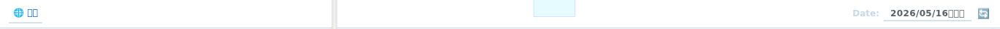
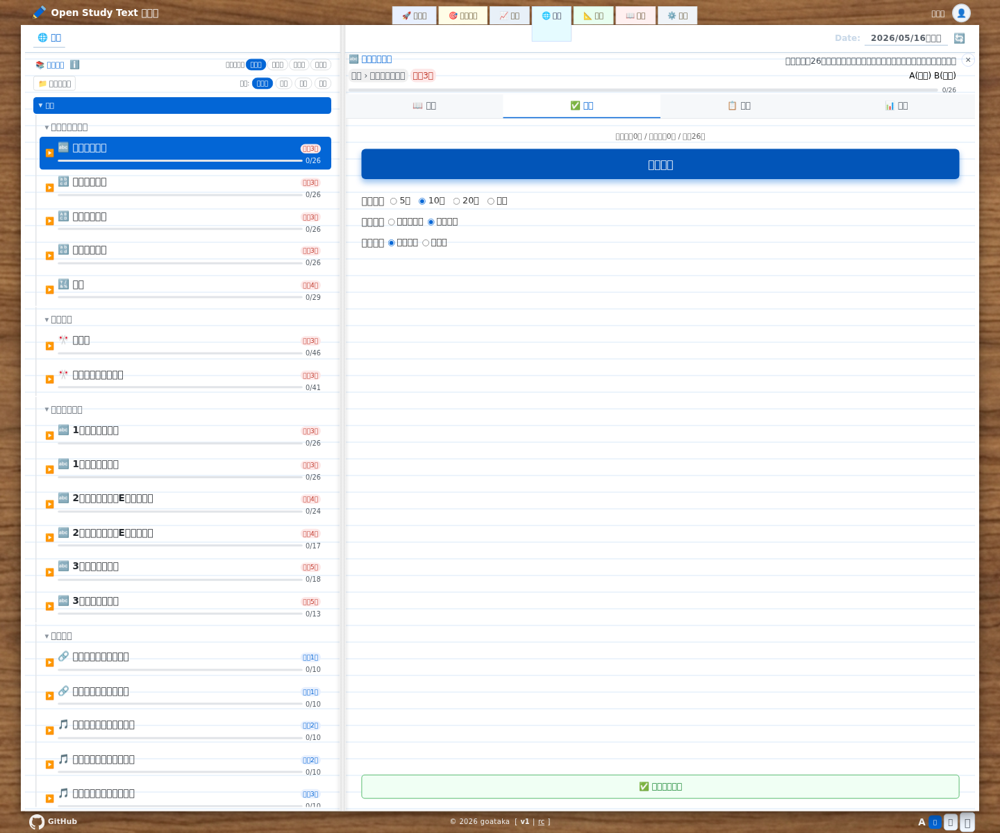
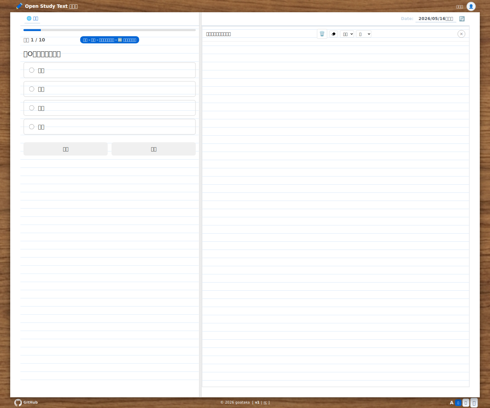
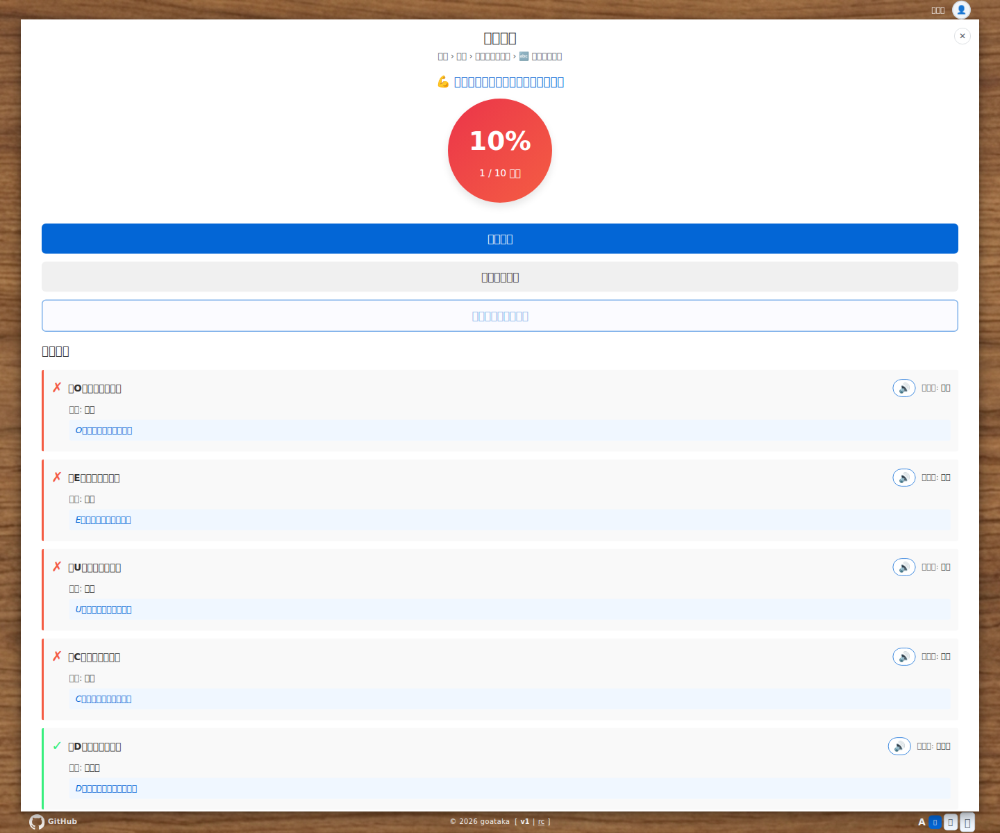
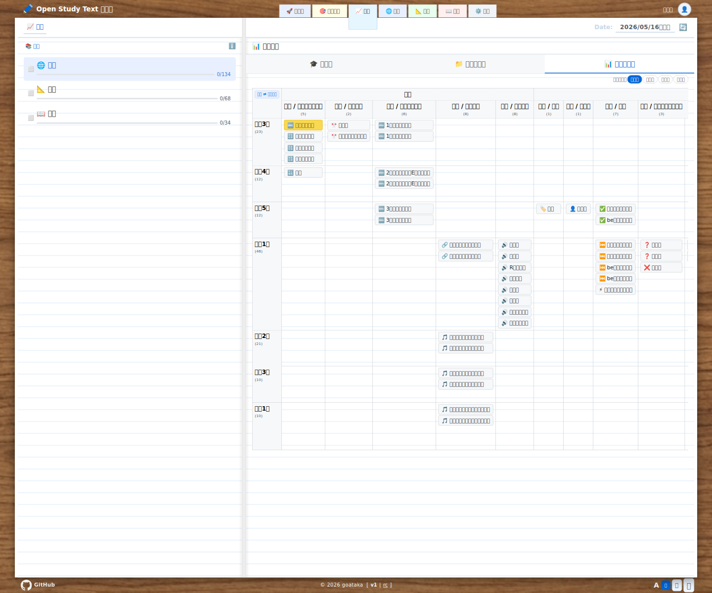
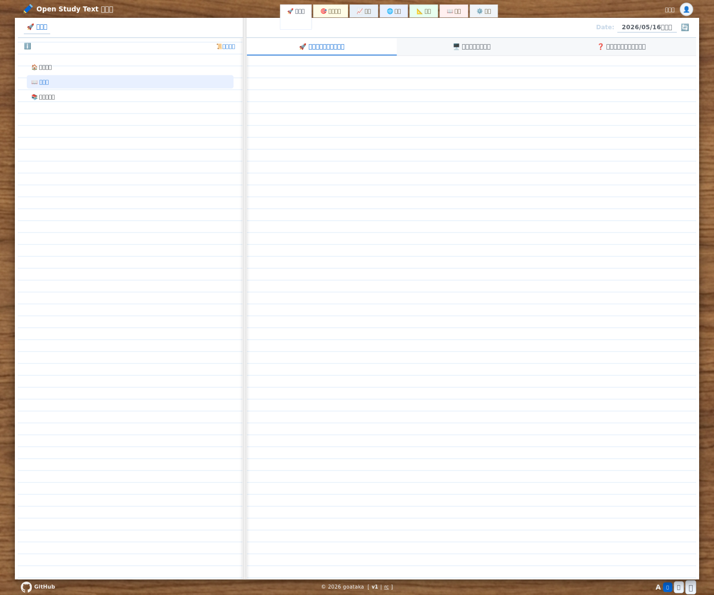
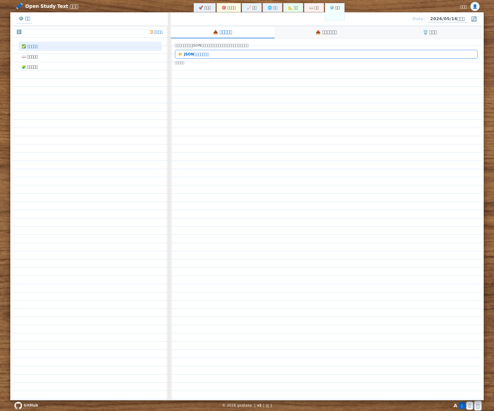

# 機能リファレンス

学習アプリの各画面と機能を説明します。

## ヘッダー

画面上部に常時表示されるバーです。

| パーツ | 説明 |
|--------|------|
| アプリ名（タイトル） | クリックするとスタート画面に戻る（クイズ中は確認ダイアログを表示） |
| ユーザー名ボタン | クリックすると名前の編集欄が開く |
| 今日の日付 | 現在の日付を表示する |
| 🔄（更新ボタン） | ページを再読み込みする（日付の右に表示） |
| 小/中/大（文字サイズ） | アプリ全体の文字サイズを切り替える（解説タブにも反映） |

## スタート画面

アプリを開いたときに最初に表示される画面です。

左にタブ・単元一覧、右に選択中単元の詳細が並びます。初回は「🚀 ガイド」、2回目以降は「🎯 おすすめ」が開きます。

### 教科タブ

| タブ | 説明 |
|------|------|
| 🎯 おすすめ | 全教科のおすすめ単元と学習状況サマリを表示する（2回目以降の初期表示） |
| 🚀 ガイド | 使い方・教科・単元・サポート情報を表示する（初回表示） |
| 📈 進度 | 教科別の学習進度をカテゴリ別・学年別に確認できる |
| 🌐 英語 | 英語の単元一覧を表示する |
| 📐 数学 | 数学の単元一覧を表示する |
| 📖 国語 | 国語の単元一覧を表示する |
| ⚙️ 管理 | 学習データのインポート・エクスポート・初期化ができる |

### おすすめタブ

おすすめタブ選択時は、全教科横断のおすすめ単元が表示されます。

#### 学習状況パネル

| パーツ | 説明 |
|--------|------|
| 学習数 n/目標 | 今日の学習数と目標数を星の上に表示する |
| 星（☆/⭐） | 目標数に連動した星。学習済みは ⭐、未達成は ☆ |
| 次の単元 | 最初に取り組むおすすめ単元（教科名 › トップ › 親 › 単元名）を星の下に表示する |
| スタートボタン | おすすめ先頭単元を開く（未学習は `📖 解説`、学習済みは `✅ 確認`） |
| 今日やった単元 | スタートボタンの下に当日学習した単元を表示する（単元リストのみスクロール） |

#### 今日の単元リスト

| パーツ | 説明 |
|--------|------|
| タイトル右の ℹ️ | クリックすると抽出条件を箇条書きで表示する（未学習優先 / 学習済📝7日後・復習済📜14日後の復習対象 / 検定済🎓除外 / 国語→数学→英語優先） |
| 目標数コントロール | おすすめ表示の目標数（2/3/5/8/13）を切り替える |
| 単元カード | 教科絵文字・単元名・ステージ表示・進捗バーを表示。クリックで単元を選択する |
| 目標ライン | 「🎯 目標ここまで」で目標分との境界を表示する |
| 🚀 もっと追加 | クリックするとおすすめ単元を追加で表示する |

### 単元一覧（教科タブ）

教科タブを選択すると、左パネルに単元一覧が表示されます。

| パーツ | 説明 |
|--------|------|
| 学習状況フィルター | すべて／未学習／学習中／学習済み で単元を絞り込む |
| カテゴリ別／学年別ボタン | 単元をカテゴリ順または学年順に並べ替える |
| 学習済みを隠すボタン | 学習済みの単元を非表示にする |
| カテゴリ／学年の解説ボタン | 各グループ見出しの `📖 解説` から、そのカテゴリや学年に対応した解説を表示する |
| 単元アイテム | クリックすると単元を選択し、右パネルに詳細が表示される。単元名の横に `📝` 学習済 / `📜` 復習済 / `🎓` 検定済 を表示する |
| 進捗バー | 各単元の正解率を棒グラフで表示する |
| 学年バッジ | 対象学年を色付きバッジで表示する（赤＝小学、青＝中学、緑＝高校） |

### 単元詳細（右パネル）

単元を選択すると右パネルに詳細が表示されます。

#### タブ

| タブ | 説明 |
|------|------|
| 📖 解説 | 選択した単元の解説ページを表示する |
| ✅ 確認 | クイズの設定と開始ボタン |
| 📋 問題 | 単元の問題一覧を表示する |
| 📊 履歴 | 過去の回答履歴を表示する |

#### 解説タブ

選択した単元の解説ページをアプリ内に表示します。文字サイズは「小/中/大」ボタンと連動します。

#### 確認タブ（クイズ設定）

| パーツ | 説明 |
|--------|------|
| スタートボタン | 設定した条件でクイズを開始する |
| 問題数 | 5問 / 10問 / 20問 / 全て から選択する |
| 並び順 | ストレート（順番通り）またはランダムで出題する |
| 学習済 | 学習済みの問題を含めるかどうか |
| ✅ 履修済にするボタン | 選択した単元を履修済みとしてマークする |

#### 問題タブ

| パーツ | 説明 |
|--------|------|
| すべて／未学習／学習済み フィルター | 表示する問題を絞り込む |
| 問題一覧 | 問題文と正解・不正解状況を一覧表示する |

#### 履歴タブ

過去のクイズ結果を日付ごとにまとめて表示します。

## 問題画面

クイズ開始後に表示される画面です。

左側で問題に答え、右側でメモや手書き入力を行います。PC・タブレットでは左右2カラム、画面幅が狭い場合は縦並びになります。

### 問題エリア（左側）

| パーツ | 説明 |
|--------|------|
| プログレスバー | 全問題中の現在の進捗を表示する |
| 問題番号 | 「1/10」のように現在の問題番号を表示する |
| 単元名バッジ | 現在の問題の単元名を表示する |
| ✕（中止ボタン） | クイズを中止してスタート画面に戻る（確認ダイアログあり） |
| 問題文 | 出題される問題を表示する |
| 選択肢ボタン | 4択の回答候補。タップ（クリック）して回答する |
| 前へ／次へボタン | 問題を前後に移動する |
| 採点するボタン | 全問回答後に表示。クリックすると結果画面へ進む |

### 回答フィードバック

選択肢を選んだ後に表示されます。

| パーツ | 説明 |
|--------|------|
| ⭕ 正解 / ✕ 不正解 | 正誤を表示する |
| 解説テキスト | 正解の理由や補足説明を表示する |

### メモエリア（右側）

問題を解くときに使えるメモ帳です。

| パーツ | 説明 |
|--------|------|
| 🗑️（クリアボタン） | メモキャンバスをすべて消去する |
| 消しゴムボタン | 消しゴムモードに切り替える |
| 線の太さ（普通/太い/極太） | ペンの太さを選択する |
| 色（黒/青/赤/緑） | ペンの色を選択する |
| メモキャンバス | 自由に書き込めるキャンバス |

#### 手書き文字入力（text-input問題）

記述式問題では、メモエリアが手書き文字入力に切り替わります。

| パーツ | 説明 |
|--------|------|
| 手書きキャンバス | 1文字ずつ書いて文字を入力する |
| 候補ボタン | 書いた文字の認識候補を表示する。クリックすると解答欄に入力される（英語問題ではアルファベット候補のみ表示し、認識できない場合は候補を表示しない） |
| ↩（1画消すボタン） | 最後に書いた1画を取り消す |
| 🗑️（全消しボタン） | キャンバスをすべて消去する |

## 結果画面

全問回答・採点後に表示される画面です。

採点後は、正解数とメッセージ、各問題の正誤・解説をまとめて確認できます。

| パーツ | 説明 |
|--------|------|
| クイズ結果 | 正解数（例：8/10問正解）を表示する |
| 正解メッセージ | 正解率に応じたメッセージを表示する |
| 問題一覧 | 各問題の正誤・正解・解説を一覧で表示する |
| もう一度ボタン | 同じ単元を再度練習する |
| スタート画面に戻るボタン | スタート画面に戻る |

## 進度タブ

教科タブで「📈 進度」を選択すると表示されます。左列の教科をクリックして教科ごとの進度を確認できます。

### 左パネル（教科一覧）

| パーツ | 説明 |
|--------|------|
| 教科カード | 英語・数学・国語ごとの進度を表示し、クリックすると右パネルの表示対象を切り替える |
| 状態アイコン | `✅` 習得済み / `🟨` 学習中 / `⬜` 未学習 の目安を表示する |
| 進捗バー | 教科ごとの「習得済み単元数 / 総単元数」を棒グラフで表示する |

### 右パネル（進度詳細）

| パーツ | 説明 |
|--------|------|
| 学年別 / カテゴリ別 / マトリクス | 単元の並び方を切り替える |
| すべて / 未学習 / 学習中 / 学習済み | 表示する単元を学習状況で絞り込む |
| 単元ブロック | 各単元の位置と進み具合を一覧できる。クリックするとその単元をスタート画面で開く |
| マトリクス切り替え | マトリクス表示では、学年×カテゴリの縦横を入れ替えて見やすい向きに変更できる |

## ガイドタブ

教科タブで「🚀 ガイド」を選択すると表示されます。左列のメニューから以下を選べます。

| メニュー | 説明 |
|----------|------|
| 🏠 はじめに | アプリの概要とサポート情報を表示する |
| 📖 使い方 | スタートアップガイド・機能リファレンス・トラブルシューティングを表示する |
| 📚 教科・単元 | 全教科の単元一覧（解説・確認リンク付き）を表示する |

### 使い方メニュー（📖 使い方）

| タブ | 説明 |
|------|------|
| 🚀 スタートアップガイド | 初回利用時の流れと基本操作を表示する |
| 🖥️ 機能リファレンス | 各画面・各ボタンの役割を一覧で確認する |
| ❓ トラブルシューティング | よくある困りごとと対処方法を表示する |

### 教科・単元メニュー（📚 教科・単元）

| パーツ | 説明 |
|--------|------|
| 教科タブ | 教科ごとに単元一覧を切り替える |
| 単元テーブル | 単元名・例・解説リンク・確認リンクを一覧する |
| 解説 / 確認 リンク | 対応する単元の解説やクイズ開始画面へ移動する |

## 管理タブ

教科タブで「⚙️ 管理」を選択すると表示されます。学習データの管理ができます。

### 左メニュー

| メニュー | 説明 |
|----------|------|
| 📦 管理 | データのインポート・エクスポート・初期化を行う |
| 👁 データ参照 | 設定・履歴・学習済み問題・連続正解データを確認する |
| 📋 仕様 | アプリの仕様・データ構造の説明を表示する |

### 管理メニュー（📦 管理）

| タブ | 説明 |
|------|------|
| 📥 インポート | ダウンロードしたJSONファイルを選択してデータを更新する |
| 📤 エクスポート | 学習データ（履歴・学習済み・連続正解）を個別または一括でJSONファイルとしてダウンロードする |
| 🗑️ 初期化 | 全データを削除してリセットする（確認ダイアログあり） |

### データ参照メニュー（👁 データ参照）

| タブ / パーツ | 説明 |
|---------------|------|
| 設定 | 現在の学習設定や保存値をJSONで確認する |
| 履歴 | クイズ履歴データをJSONで確認する |
| 学習済み問題 | 学習済みとして記録された問題データをJSONで確認する |
| 連続正解 | 連続正解数の保存データをJSONで確認する |
| コピーボタン | 表示中のJSONをクリップボードへコピーする |

### 仕様メニュー（📋 仕様）

`support/technical-reference.md` の内容をアプリ内で表示し、保存データやJSON構造の仕様を確認できます。
